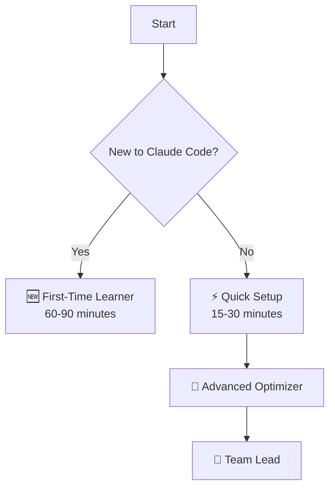
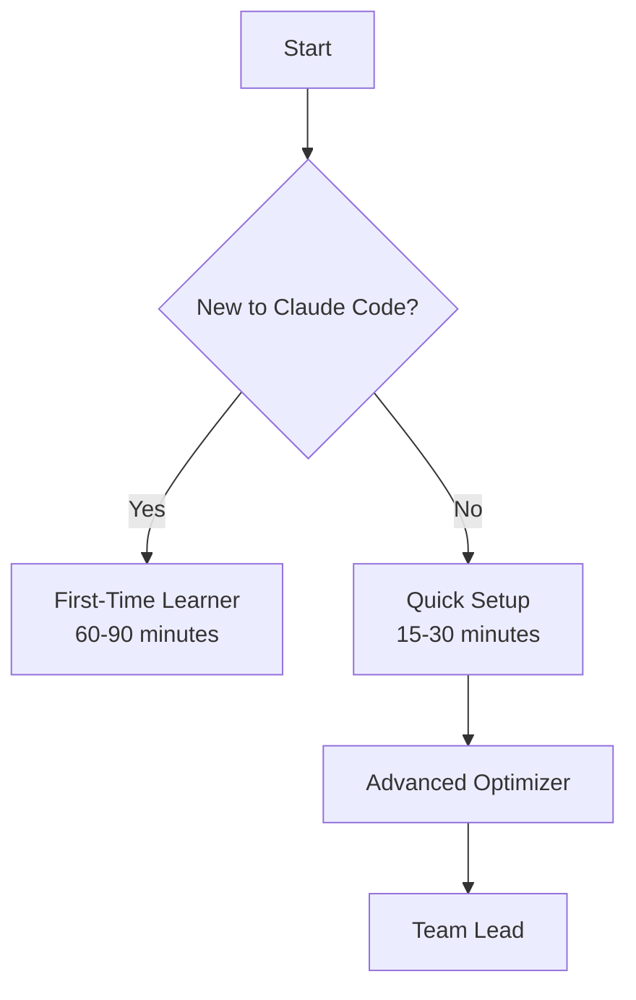
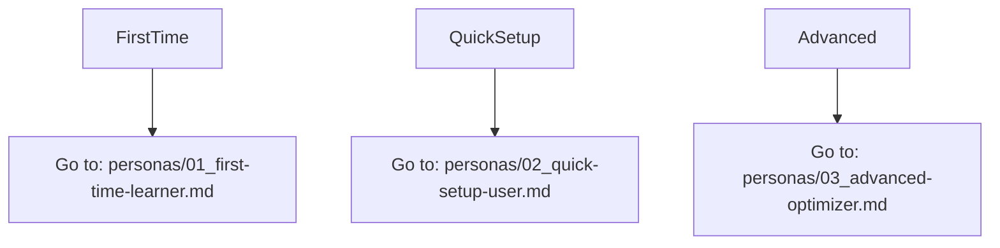
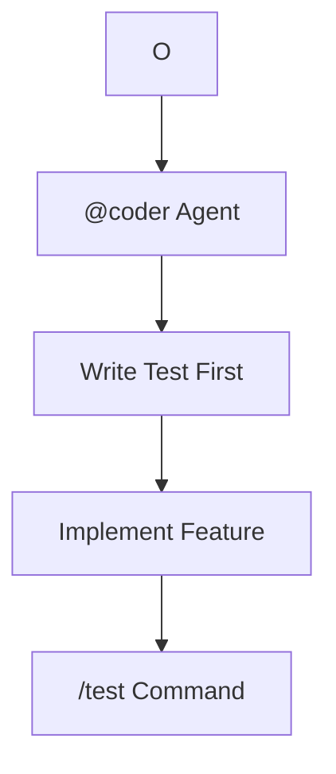
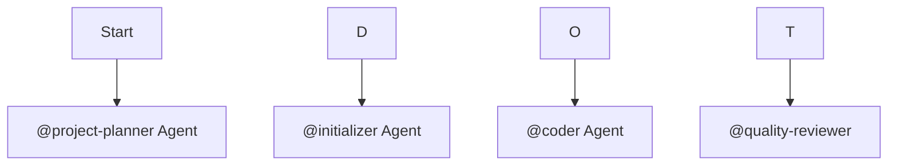
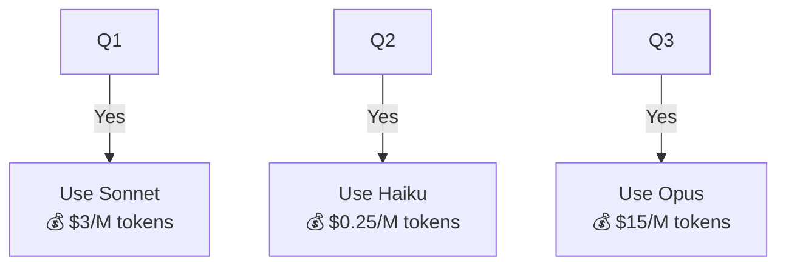
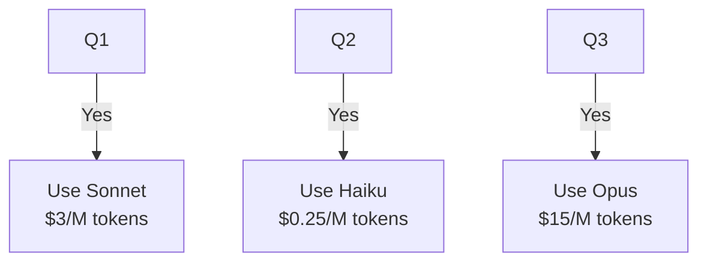
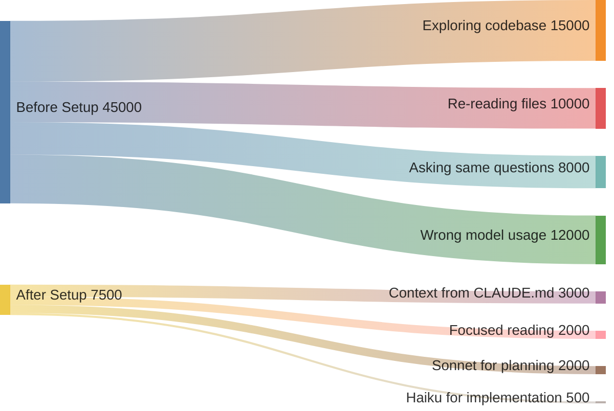
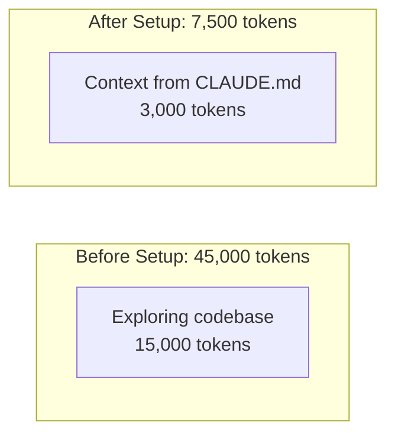
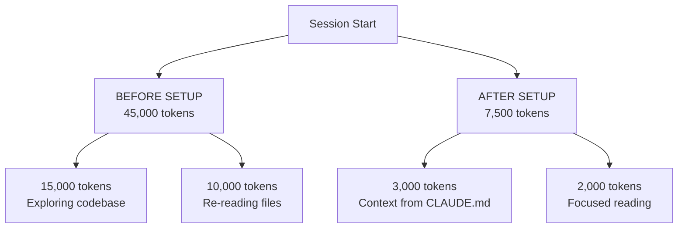

# Common Mermaid Issues & Fixes

**Source:** Workflow analysis of 13 Mermaid-related commits in claude-config-template

---

## Issue 1: Emojis in Node Labels (5 occurrences)

### ❌ Broken Code


### ⚠️ Error
- VS Code: Renders blank or shows raw code
- Some Mermaid parsers fail on emoji characters
- Inconsistent cross-editor behavior

### ✅ Fixed Code


### 💡 Rule
**Remove all emojis from node labels.** Use descriptive text instead.

---

## Issue 2: Unquoted File Paths (4 occurrences)

### ❌ Broken Code


### ⚠️ Error
- Forward slashes `/` confuse Mermaid parser
- Underscores and hyphens in filenames cause issues
- Error: "Lexical error... Unrecognized text"

### ✅ Fixed Code


### 💡 Rule
**Quote all node labels containing file paths or special characters.**

---

## Issue 3: Unquoted Commands (3 occurrences)

### ❌ Broken Code
```mermaid
graph TD
    O --> P["@coder Agent"]
    P --> Q[Write Test First]
    Q --> R[Implement Feature]
    R --> S[/test Command]
```

### ⚠️ Error
- Forward slash `/` interpreted as division operator
- Error: "Lexical error on line X"
- Diagram renders blank

### ✅ Fixed Code


### 💡 Rule
**Quote all commands starting with `/` or `@`.**

---

## Issue 4: Unquoted @ Symbols (2 occurrences)

### ❌ Broken Code
```mermaid
graph TD
    A[Start] --> B[@project-planner Agent]
    D --> K[@initializer Agent]
    O --> P[@coder Agent]
    T --> U[@quality-reviewer]
```

### ⚠️ Error
- `@` symbol causes "Parse error... got 'LINK_ID'"
- Mermaid interprets @ as special syntax
- Inconsistent rendering

### ✅ Fixed Code


### 💡 Rule
**Quote all node labels containing `@` symbols.**

---

## Issue 5: Dollar Signs & Special Chars (2 occurrences)

### ❌ Broken Code


### ⚠️ Error
- Emoji + dollar sign combination fails
- `$` can be interpreted as variable
- Multiple special chars compound issues

### ✅ Fixed Code


### 💡 Rule
**Remove emojis, quote labels with `$` or other special characters.**

---

## Issue 6: Experimental Diagram Types (1 occurrence, 3 fixes)

### ❌ Broken Code


### ⚠️ Error
- `sankey-beta` is experimental (Mermaid 10.x+ only)
- VS Code default extension (8.x-9.x) doesn't support it
- Renders completely blank

### ✅ Fixed Code (Attempt 1: Subgraphs - Still Failed)


### ✅ Fixed Code (Attempt 2: Final Working Solution)


### 💡 Rule
**Avoid experimental diagram types. Stick to:**
- `graph TD` / `graph LR` (most compatible)
- `flowchart TD` / `flowchart LR` (Mermaid 9.0+)
- Avoid: `sankey-beta`, `mindmap`, `timeline` (limited support)

---

## Summary: Special Characters Requiring Quotes

| Character | Example | Must Quote |
|-----------|---------|------------|
| `/` | /test, /model | ✅ Yes |
| `@` | @agent-name | ✅ Yes |
| `~` | ~/.claude | ✅ Yes |
| `$` | $3/M | ✅ Yes |
| `-` in paths | 01_first-time | ✅ Yes (in file paths) |
| `_` in paths | first_time | ✅ Yes (in file paths) |
| Emojis | 🆕 ⚡ 🚀 | ❌ Remove entirely |
| Spaces | Multiple words | ✅ Yes (if special chars present) |

---

## Quick Validation Checklist

Before committing Mermaid diagrams:

- [ ] No emojis in node labels
- [ ] All file paths quoted: `["path/to/file.md"]`
- [ ] All commands quoted: `["/command"]`
- [ ] All @ symbols quoted: `["@agent-name"]`
- [ ] No experimental diagram types (sankey-beta, mindmap)
- [ ] ASCII fallback provided below diagram
- [ ] Test in VS Code preview (Cmd+Shift+V)

**Command:** `claude "Check my Mermaid diagram"` (uses this skill)

---

**Based On:** Real commits from claude-config-template
- 13 Mermaid fix commits analyzed
- 5 emoji removals
- 4 file path quotes
- 3 command quotes
- 2 @ symbol quotes
- 1 experimental diagram replacement (3 attempts)

**Lessons Learned:**
1. Emojis are the #1 cause of failures (5/13 commits)
2. File paths are #2 (4/13 commits)
3. Experimental features cause the most iterations (3 attempts for 1 fix)
4. When in doubt, add quotes!
