# Validation Scenarios

**Real examples from claude-config-template workflow**

---

## Scenario 1: User Commits New Diagram

**Context:** Adding a new decision flowchart to documentation

### User Query:
> "Check my Mermaid diagram before I commit"

### Input Diagram:

```mermaid
flowchart TD
    Start([Start: New to template?]) --> Q1{New to Claude Code?}
    Q1 -->|Yes| FirstTime[🆕 First-Time<br/>60-90 min]
    Q1 -->|No| Q2{Have project?}
    Q2 -->|Yes| Quick[⚡ Quick Setup<br/>15-30 min]
    Q2 -->|No| Advanced[🚀 Advanced<br/>20-40 min]
```


### Skill Response:
```
🔍 Mermaid Syntax Validation

Analyzing diagram...

❌ Issues Found (3):

1. Line 3: Unquoted emoji in node label
   Location: FirstTime[🆕 First-Time<br/>60-90 min]
   Fix: FirstTime["First-Time<br/>60-90 min"]
   Reason: Emojis cause rendering failures

2. Line 5: Unquoted emoji in node label
   Location: Quick[⚡ Quick Setup<br/>15-30 min]
   Fix: Quick["Quick Setup<br/>15-30 min"]
   Reason: Emojis cause rendering failures

3. Line 6: Unquoted emoji in node label
   Location: Advanced[🚀 Advanced<br/>20-40 min]
   Fix: Advanced["Advanced<br/>20-40 min"]
   Reason: Emojis cause rendering failures

⚠️ Compatibility: Will fail in VS Code with default extension

Next: Say "fix my Mermaid diagram" to auto-apply fixes
```

### Outcome:
- ✅ Issues caught before commit
- ✅ Prevented fixup commit
- ✅ Saved 400 tokens in iterative debugging

---

## Scenario 2: Validating Entire Repository

**Context:** Pre-commit check before pushing documentation updates

### User Query:
> "Validate all Mermaid diagrams before commit"

### Skill Response:
```
🔍 Pre-Commit Mermaid Validation

Scanning repository...

Files checked: 87
Mermaid diagrams found: 11

Results:
✅ docs/00-start-here/06_visual-guides.md
   - Configuration Hierarchy (Line 19): OK
   - Model Selection (Line 66): OK
   - CLAUDE.md Anatomy (Line 132): OK
   - Setup Roadmap (Line 182): OK
   - Token Cost Waterfall (Line 228): OK

✅ docs/00-start-here/07_visual-quickstart.md
   - Interactive Decision (Line 17): OK

✅ docs/00-start-here/08_visual-workflows.md
   - Workflow #1 (Line 42): OK
   - Workflow #2 (Line 105): OK
   - Workflow #3 (Line 175): OK
   - Workflow #4 (Line 245): OK
   - Workflow #5 (Line 312): OK

Total: 11 diagrams
Status: ✅ All passed
Issues: 0 found

Safe to commit!

💡 These diagrams were fixed in previous commits
📊 Prevented issues: Emoji labels, unquoted paths, @ symbols
```

### Outcome:
- ✅ Comprehensive validation
- ✅ Confidence before push
- ✅ Zero issues (all previous fixes working)

---

## Scenario 3: User Encounters Rendering Failure

**Context:** Diagram renders on GitHub but not in VS Code

### User Query:
> "Why isn't my Mermaid diagram rendering in VS Code?"

### Context Provided:
```mermaid
graph TD
    O --> P[@coder Agent]
    P --> Q[Write Test First]
    R --> S[/test Command]
```

### Skill Response:
```
🔍 Diagnosing Mermaid Rendering Issue

Detected issues:

❌ Line 2: Unquoted @ symbol
   Current: P[@coder Agent]
   Fix: P["@coder Agent"]
   Why: @ is special syntax in Mermaid

❌ Line 4: Unquoted forward slash
   Current: S[/test Command]
   Fix: S["/test Command"]
   Why: / interpreted as division operator

Root cause: Special characters without quotes
Impact: Works on GitHub (more forgiving), fails in VS Code

✅ Fixed version:


Apply fixes and reload VS Code (Cmd+Shift+P → Reload Window)

💡 Rule: Always quote @ and / characters
```

### Outcome:
- ✅ Root cause identified
- ✅ Fixed diagram provided
- ✅ Cross-editor compatibility explained

---

## Scenario 4: Experimental Feature Question

**Context:** User wants to use sankey diagram for token flow

### User Query:
> "Should I use sankey-beta for the token cost diagram?"

### Skill Response:
```
⚠️ Experimental Feature Advisory: sankey-beta

Status: ❌ NOT RECOMMENDED

Your project history shows:
- Commit e9d3dd9: Tried sankey-beta
- Commit eaaa3fb: Replaced with subgraphs (still failed)
- Commit 0821b65: Replaced with graph TD (finally worked)

Result: 3 commits to fix 1 diagram

Why sankey-beta fails:
- Requires Mermaid 10.x+ (experimental)
- VS Code default extension: 8.x-9.x
- GitHub: Works (but not universal)

✅ RECOMMENDED: Use graph TD instead

Working example from your repo:


Lessons learned:
- Stick to graph TD/LR for compatibility
- Avoid experimental features in docs
- Keep ASCII fallback for universal access

💡 Save time: Use proven patterns from your codebase
```

### Outcome:
- ✅ Prevented 3-commit debugging cycle
- ✅ Recommended proven solution
- ✅ Referenced working code from repo

---

## Scenario 5: Quick Syntax Reference

**Context:** User writing new diagram, wants to avoid mistakes

### User Query:
> "What Mermaid syntax do I need to quote?"

### Skill Response:
```
📋 Mermaid Quoting Quick Reference

Based on your 13 Mermaid fix commits:

🔴 ALWAYS QUOTE (95% of your issues):
✅ Forward slash: ["/test"] ["/model haiku"]
✅ At symbol: ["@project-planner"] ["@coder"]
✅ Tilde paths: ["~/.claude.json"]
✅ File paths: ["personas/01_first-time.md"]
✅ Dollar signs: ["$3/M tokens"] (remove 💰 first!)

🚫 NEVER USE:
❌ Emojis: 🆕 ⚡ 🚀 👥 🔄 💰 (5 commits fixing these!)
❌ Experimental: sankey-beta, mindmap (3 commits fixing!)

✅ SAFE (no quotes needed):
• Single words: [Sonnet] [Haiku] [Start]
• Numbers: [3000] [92%]
• Simple phrases: [Task Complete]

💡 When in doubt: ADD QUOTES!

Your most common mistakes (from git history):
1. Emojis in labels (5 times)
2. File paths without quotes (4 times)
3. Commands without quotes (3 times)

Next: "Check my Mermaid diagram" to validate
```

### Outcome:
- ✅ Quick reference at hand
- ✅ Personalized to user's patterns
- ✅ Prevents most common errors

---

## Token Savings Analysis

### Without mermaid-validator skill:
```
Commit 1: "fix: Mermaid emoji in FirstTime node" (400 tokens)
Commit 2: "fix: Mermaid emoji in QuickSetup node" (400 tokens)
Commit 3: "fix: Mermaid file path syntax" (400 tokens)
Commit 4: "fix: Mermaid @ symbol syntax" (400 tokens)
Commit 5: "fix: Mermaid slash command" (400 tokens)
...
Total: 13 commits × 400 = 5,200 tokens wasted
```

### With mermaid-validator skill:
```
Single validation: "Check my Mermaid diagram" (300 tokens)
All issues caught upfront
Zero fixup commits needed

Savings: 5,200 - 300 = 4,900 tokens (94% reduction)
```

### Monthly Projection:
- 2 documentation sessions with Mermaid diagrams
- 4,900 × 2 = 9,800 tokens/month saved
- Cost: ~$0.29/month

### ROI:
- Skill creation: 800 tokens (one-time)
- First use savings: 4,900 tokens
- Payback: Immediate (first validation)

---

## Integration Example

### Git Pre-Commit Hook
```bash
#!/bin/bash
# .git/hooks/pre-commit

# Check if any .md files changed
if git diff --cached --name-only | grep -q '\.md$'; then
    echo "🔍 Validating Mermaid diagrams..."

    # Run validation (requires Claude Code)
    claude "Validate all Mermaid diagrams before commit"

    if [ $? -ne 0 ]; then
        echo "❌ Mermaid validation failed"
        echo "Fix issues or bypass with: git commit --no-verify"
        exit 1
    fi

    echo "✅ Mermaid validation passed"
fi
```

### Usage:
```bash
# Normal commit (runs validation automatically)
git commit -m "docs: Add new workflow diagram"

# Output:
# 🔍 Validating Mermaid diagrams...
# ❌ Issues Found: 3 emojis in node labels
# Fix issues or bypass with: git commit --no-verify

# After fixing
git commit -m "docs: Add new workflow diagram"

# Output:
# 🔍 Validating Mermaid diagrams...
# ✅ Mermaid validation passed
# [main abc1234] docs: Add new workflow diagram
```

---

**Skill Impact Summary:**

| Metric | Value |
|--------|-------|
| **Commits prevented** | 13 (from workflow analysis) |
| **Tokens saved per validation** | 4,900 (94% reduction) |
| **Most common issue** | Emojis in labels (38%) |
| **Second most common** | Unquoted file paths (31%) |
| **Worst issue** | Experimental sankey-beta (3 commits to fix) |
| **Monthly savings** | 9,800 tokens (~$0.29) |
| **ROI** | Immediate (first use) |
