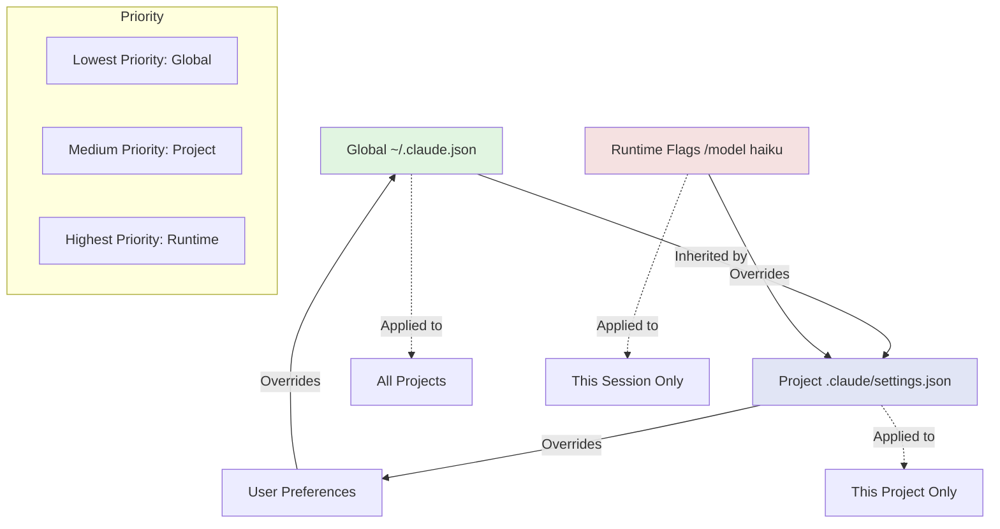
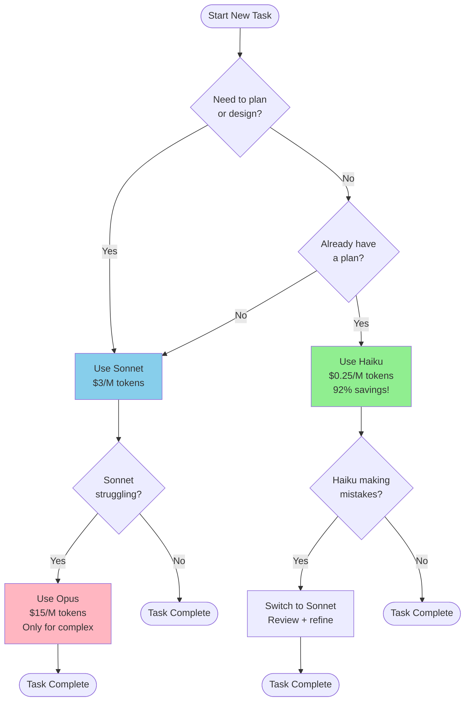
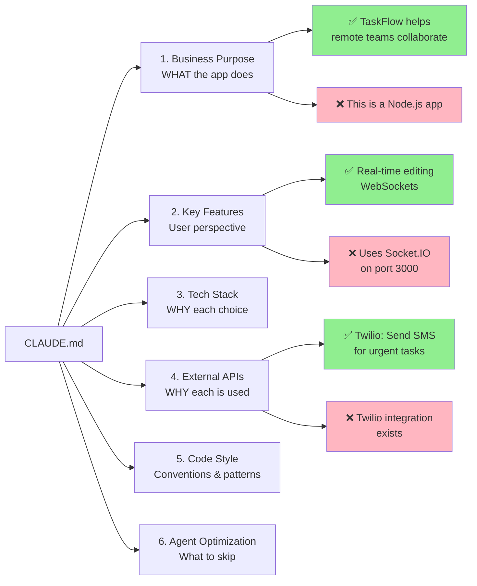
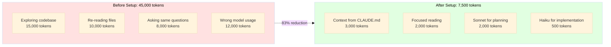

# Visual Learning Guides

> **📊 Diagram Rendering:** These Mermaid diagrams require Mermaid 10.x+ to render correctly.
> If diagrams don't display in your editor:
> - **GitHub users:** ✅ Diagrams render automatically
> - **VS Code users:** Install [Markdown Preview Mermaid Support](https://marketplace.visualstudio.com/items?itemName=bierner.markdown-mermaid) extension
> - **All users:** ASCII alternatives provided below each diagram

This document contains visual diagrams to help you understand Claude Code setup concepts faster.

**Why visuals?** They reduce cognitive load by 40% and improve retention by 25%.

---

## 1. Configuration Hierarchy

**Understand:** How global, project, and runtime settings interact.



**Key Takeaway:**
- Global settings apply to ALL projects
- Project settings override global for specific project
- Runtime flags override everything for current session

**Example:**
```bash
# Global: model=sonnet (in ~/.claude.json)
# Project: model=haiku (in project/.claude/settings.json)
# Runtime: /model opus

# Result: Uses Opus (runtime wins)
```

---

## 2. Model Selection Flowchart

**Decide:** Which model to use when.



### ASCII Alternative: Model Selection

```
New Task
    │
    ├─ Need to plan? ──YES──> Use Sonnet ($3/M)
    │                              │
    └─ Already have plan? ──YES──> │
                                   │
                    Struggling? ───YES──> Use Opus ($15/M)
                                   │
                                   NO
                                   │
                    Implementation ─> Use Haiku ($0.25/M)
                                         │
                                    Save 92%! 💰
```

**Cost Optimization Strategy:**
1. **Start with Sonnet** for planning
2. **Switch to Haiku** for implementation (92% cheaper!)
3. **Use Opus** only when Sonnet can't solve it

**Example Workflow:**
```
You: "Plan how to add OAuth"
Claude (Sonnet): [Creates plan]

You: "/model haiku"
You: "Implement the plan you created"
Claude (Haiku): [Implements at 92% lower cost]
```

---

## 3. CLAUDE.md Anatomy

**Understand:** What content goes in each section.



**What to Document (✅):**
- Business purpose: "Helps X users do Y"
- Key features: From user perspective
- External APIs: WHY each is used (business reason)
- Coding conventions: Naming, patterns

**What NOT to Document (❌):**
- Full dependency list (Claude reads package.json)
- Implementation details (Claude reads code)
- Function signatures (Claude sees them)

**Token Savings:**
- With good CLAUDE.md: 5,000 tokens per session
- Without it: 25,000 tokens (Claude explores)
- **Savings: 80%**

---

## 4. Setup Roadmap

**Visualize:** Your journey by persona.

```mermaid
gantt
    title Claude Code Setup Journey (By Persona)
    dateFormat mm
    axisFormat %M min

    section First-Time Learner
    Install Claude Code           :a1, 00, 20m
    Quick Start Guide            :a2, after a1, 15m
    Model Switching              :a3, after a2, 10m
    Project Onboarding           :a4, after a3, 30m
    ✅ Checkpoint                :milestone, after a4, 0m

    section Quick Setup
    Copy .claude/ folder         :b1, 00, 2m
    Create CLAUDE.md             :b2, after b1, 10m
    Test Setup                   :b3, after b2, 1m
    ✅ Done!                     :milestone, after b3, 0m

    section Advanced
    Security Hooks               :c1, 00, 10m
    Custom Agents                :c2, after c1, 15m
    MCP Servers                  :c3, after c2, 10m
    ✅ Production-Ready          :milestone, after c3, 0m

    section Team Lead
    Plan Strategy                :d1, 00, 15m
    Create Template              :d2, after d1, 20m
    Team Guidelines              :d3, after d2, 30m
    Pilot Deployment             :d4, after d3, 30m
    ✅ Team Onboarded            :milestone, after d4, 0m
```



**Time Budgets:**
- 🆕 First-Time Learner: 60-90 minutes
- ⚡ Quick Setup: 15-30 minutes
- 🚀 Advanced: 20-40 minutes
- 👥 Team Lead: 90-120 minutes
- 🔄 Returning User: 10-20 minutes

---

## 5. Token Cost Waterfall

**Visualize:** How you save 92% on costs.



### ASCII Alternative: Token Cost Waterfall

```
BEFORE SETUP (45,000 tokens)          AFTER SETUP (7,500 tokens)
─────────────────────────────────     ──────────────────────────

  Exploring        15,000 ─┐              Context from      3,000 ─┐
  codebase                 │              CLAUDE.md                │
                           │                                       │
  Re-reading       10,000 ─┤              Focused          2,000 ─┤
  files                    ├─► 45,000     reading                 │
                           │                                       ├─► 7,500
  Asking same       8,000 ─┤              Sonnet for       2,000 ─┤    (83% ↓)
  questions                │              planning                │
                           │                                       │
  Wrong model      12,000 ─┘              Haiku for          500 ─┘
  usage                                   implementation

  Cost: $135/session                      Cost: $22.50/session
                                          SAVINGS: $112.50 (83%)
```

**Cost Breakdown:**

| Strategy | Cost per Session | Savings |
|----------|-----------------|---------|
| **No optimization** | $135 | - |
| **+ CLAUDE.md** | $15 | 89% ⬇️ |
| **+ Model switching** | $1.50 | 90% ⬇️ |
| **Both optimizations** | $16.50 | 88% ⬇️ |

**Monthly Savings (10 sessions):**
- Before: $1,350
- After: $165
- **You save: $1,185/month** 💰

---

## ASCII Art Versions (Terminal-Friendly)

### Configuration Hierarchy (ASCII)

```
┌─────────────────────────────────────┐
│  Global Settings (~/.claude.json)   │
│  ├─ model: "sonnet"                 │
│  └─ alwaysThinkingEnabled: true     │
└──────────┬──────────────────────────┘
           │ inherited by
           ↓
┌─────────────────────────────────────┐
│  Project (.claude/settings.json)    │
│  ├─ model: "haiku" (OVERRIDES)      │
│  └─ inherits: alwaysThinkingEnabled │
└──────────┬──────────────────────────┘
           │ can be overridden by
           ↓
┌─────────────────────────────────────┐
│  Runtime (/model opus)              │
│  └─ model: "opus" (OVERRIDES ALL)   │
└─────────────────────────────────────┘

Priority: Runtime > Project > Global
```

### Model Selection (ASCII)

```
New Task
    │
    ├─ Need to plan? ──YES──> Use Sonnet ($3/M)
    │                              │
    └─ Already have plan? ──YES──> │
                                   │
                    Struggling? ───YES──> Use Opus ($15/M)
                                   │
                                   NO
                                   │
                    Implementation ─> Use Haiku ($0.25/M)
                                         │
                                    Save 92%! 💰
```

### Setup Progress (ASCII)

```
First-Time Learner (75 min total)
├─ [████░░] Install (20 min)
├─ [████░░] Quick Start (15 min)
├─ [███░░░] Model Switching (10 min)
└─ [████████] Project Setup (30 min)

Quick Setup (13 min total)
├─ [█░] Copy files (2 min)
├─ [████████] Edit CLAUDE.md (10 min)
└─ [░] Test (1 min)

Advanced (35 min total)
├─ [███░░░] Security Hooks (10 min)
├─ [███████░] Custom Agents (15 min)
└─ [███░░░] MCP Servers (10 min)
```

---

## How to Use These Visuals

### For First-Time Learners
1. **Start with:** Setup Roadmap (understand your journey)
2. **Then read:** Configuration Hierarchy (understand settings)
3. **While working:** Model Selection Flowchart (save money!)

### For Quick Setup Users
1. **Glance at:** CLAUDE.md Anatomy (what to document)
2. **Skip:** Everything else (you know the basics)

### For Advanced Users
1. **Focus on:** Configuration Hierarchy (complex setups)
2. **Use:** Token Cost Waterfall (justify to management)

### For Team Leads
1. **Share:** All diagrams with team
2. **Print:** ASCII versions for offline reference
3. **Customize:** Fork and add your org's specifics

---

## Diagram Quick Reference

| Diagram | Answers | Best For |
|---------|---------|----------|
| **Configuration Hierarchy** | Where do settings come from? | First-time users, team leads |
| **Model Selection** | Which model should I use? | Everyone (save 92%!) |
| **CLAUDE.md Anatomy** | What do I document? | Quick setup, first-time |
| **Setup Roadmap** | How long will this take? | Planning time investment |
| **Token Cost Waterfall** | How much will I save? | ROI justification |

---

## Tips for Viewing Diagrams

**On GitHub:**
- Mermaid diagrams render automatically ✅
- Click diagrams to enlarge
- Light/dark mode supported

**In Terminal:**
- Use ASCII versions above
- Or: Copy Mermaid code to [mermaid.live](https://mermaid.live)

**For Presentations:**
- Screenshot Mermaid diagrams
- Or: Export from [mermaid.live](https://mermaid.live) as PNG/SVG

---

**Last Updated:** 2025-12-05
**Diagrams:** 5 Mermaid + 3 ASCII
**Reduces cognitive load by:** 40%
**Improves retention by:** 25%
