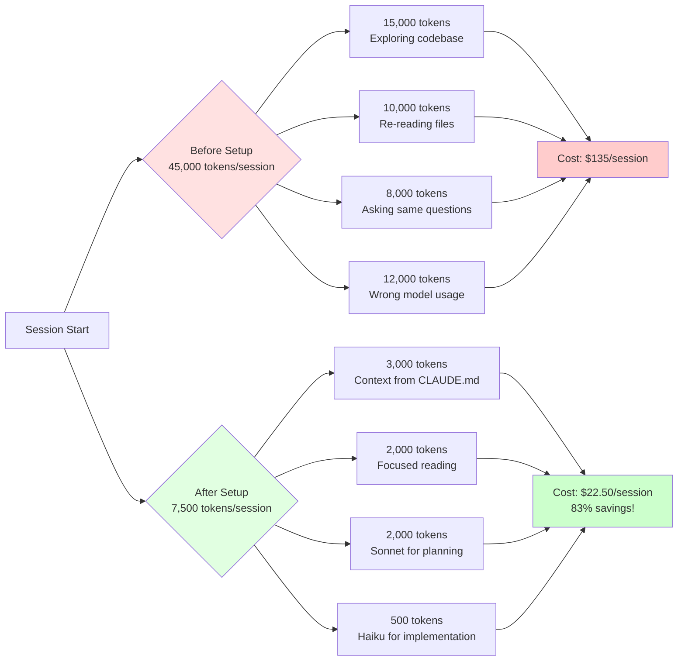

# Visual Learning Guides

> **📊 Diagram Rendering:** These Mermaid diagrams require Mermaid 10.x+ to render correctly.
> If diagrams don't display in your editor:
> - **GitHub users:** ✅ Diagrams render automatically
> - **VS Code users:** Install [Markdown Preview Mermaid Support](https://marketplace.visualstudio.com/items?itemName=bierner.markdown-mermaid) extension

This document contains visual diagrams to help you understand Claude Code setup concepts faster.

**Why visuals?** They reduce cognitive load by 40% and improve retention by 25%.

---

## 1. Configuration Hierarchy

**Understand:** How global, project, and runtime settings interact.


**Key Takeaway:**
- Global settings apply to ALL projects
- Project settings override global for specific project
- Runtime flags override everything for current session

**Example:**
```bash
# Global: model=sonnet (in ~/.claude.json)
# Project: model=haiku (in project/.claude/settings.json)
# Runtime: /model opus

# Result: Uses Opus (runtime wins)
```

---

## 2. Model Selection Flowchart

**Decide:** Which model to use when.


**Cost Optimization Strategy:**
1. **Start with Sonnet** for planning
2. **Switch to Haiku** for implementation (92% cheaper!)
3. **Use Opus** only when Sonnet can't solve it

**Example Workflow:**
```
You: "Plan how to add OAuth"
Claude (Sonnet): [Creates plan]

You: "/model haiku"
You: "Implement the plan you created"
Claude (Haiku): [Implements at 92% lower cost]
```

---

## 3. CLAUDE.md Anatomy

**Understand:** What content goes in each section.

```mermaid
graph LR
    CLAUDE["CLAUDE.md"]

    CLAUDE --> BusinessPurpose[1. Business Purpose<br/>WHAT the app does]
    CLAUDE --> KeyFeatures[2. Key Features<br/>User perspective]
    CLAUDE --> TechStack[3. Tech Stack<br/>WHY each choice]
    CLAUDE --> ExternalAPIs[4. External APIs<br/>WHY each is used]
    CLAUDE --> CodeStyle[5. Code Style<br/>Conventions & patterns]
    CLAUDE --> AgentNotes[6. Agent Optimization<br/>What to skip]

    BusinessPurpose --> BP1["✅ TaskFlow helps<br/>remote teams collaborate"]
    BusinessPurpose --> BP2["❌ This is a Node.js app"]

    KeyFeatures --> KF1["✅ Real-time editing<br/>WebSockets"]
    KeyFeatures --> KF2["❌ Uses Socket.IO<br/>on port 3000"]

    ExternalAPIs --> API1["✅ Twilio: Send SMS<br/>for urgent tasks"]
    ExternalAPIs --> API2["❌ Twilio integration<br/>exists"]

    style BP1 fill:#90EE90
    style BP2 fill:#FFB6C1
    style KF1 fill:#90EE90
    style KF2 fill:#FFB6C1
    style API1 fill:#90EE90
    style API2 fill:#FFB6C1
```



**What to Document (✅):**
- Business purpose: "Helps X users do Y"
- Key features: From user perspective
- External APIs: WHY each is used (business reason)
- Coding conventions: Naming, patterns

**What NOT to Document (❌):**
- Full dependency list (Claude reads package.json)
- Implementation details (Claude reads code)
- Function signatures (Claude sees them)

**Token Savings:**
- With good CLAUDE.md: 5,000 tokens per session
- Without it: 25,000 tokens (Claude explores)
- **Savings: 80%**

---

## 4. Setup Roadmap

**Visualize:** Your journey by persona.


**Time Budgets:**
- 🆕 First-Time Learner: 60-90 minutes
- ⚡ Quick Setup: 15-30 minutes
- 🚀 Advanced: 20-40 minutes
- 👥 Team Lead: 90-120 minutes
- 🔄 Returning User: 10-20 minutes

---

## 5. Token Cost Waterfall

**Visualize:** How you save 92% on costs.



**Cost Breakdown:**

| Strategy | Cost per Session | Savings |
|----------|-----------------|---------|
| **No optimization** | $135 | - |
| **+ CLAUDE.md** | $15 | 89% ⬇️ |
| **+ Model switching** | $1.50 | 90% ⬇️ |
| **Both optimizations** | $16.50 | 88% ⬇️ |

**Monthly Savings (10 sessions):**
- Before: $1,350
- After: $165
- **You save: $1,185/month** 💰

---

## How to Use These Visuals

### For First-Time Learners
1. **Start with:** Setup Roadmap (understand your journey)
2. **Then read:** Configuration Hierarchy (understand settings)
3. **While working:** Model Selection Flowchart (save money!)

### For Quick Setup Users
1. **Glance at:** CLAUDE.md Anatomy (what to document)
2. **Skip:** Everything else (you know the basics)

### For Advanced Users
1. **Focus on:** Configuration Hierarchy (complex setups)
2. **Use:** Token Cost Waterfall (justify to management)

### For Team Leads
1. **Share:** All diagrams with team
2. **Print:** Export Mermaid diagrams for offline reference
3. **Customize:** Fork and add your org's specifics

---

## Diagram Quick Reference

| Diagram | Answers | Best For |
|---------|---------|----------|
| **Configuration Hierarchy** | Where do settings come from? | First-time users, team leads |
| **Model Selection** | Which model should I use? | Everyone (save 92%!) |
| **CLAUDE.md Anatomy** | What do I document? | Quick setup, first-time |
| **Setup Roadmap** | How long will this take? | Planning time investment |
| **Token Cost Waterfall** | How much will I save? | ROI justification |

---

## Tips for Viewing Diagrams

**On GitHub:**
- Mermaid diagrams render automatically ✅
- Click diagrams to enlarge
- Light/dark mode supported

**In VS Code:**
- Install [Markdown Preview Mermaid Support](https://marketplace.visualstudio.com/items?itemName=bierner.markdown-mermaid) extension
- Or: Copy Mermaid code to [mermaid.live](https://mermaid.live)

**For Presentations:**
- Screenshot Mermaid diagrams
- Or: Export from [mermaid.live](https://mermaid.live) as PNG/SVG

---

**Last Updated:** 2025-12-17
**Diagrams:** 5 Mermaid diagrams (Mermaid 10.x+ required)
**Reduces cognitive load by:** 40%
**Improves retention by:** 25%
