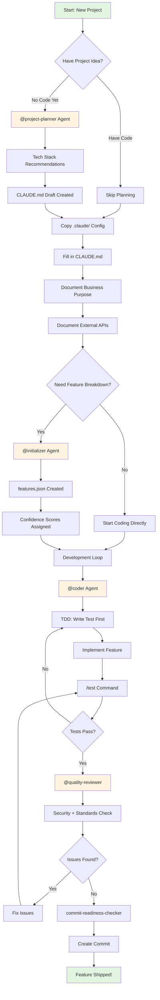
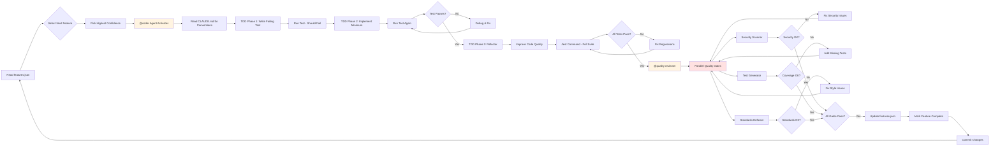
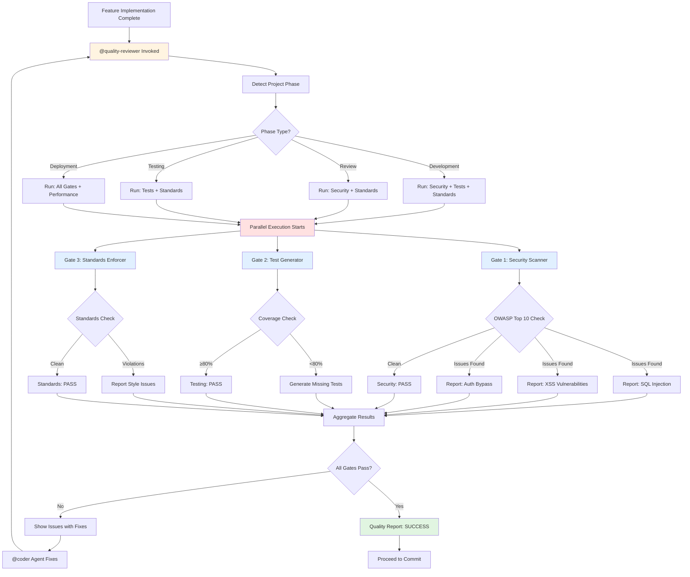
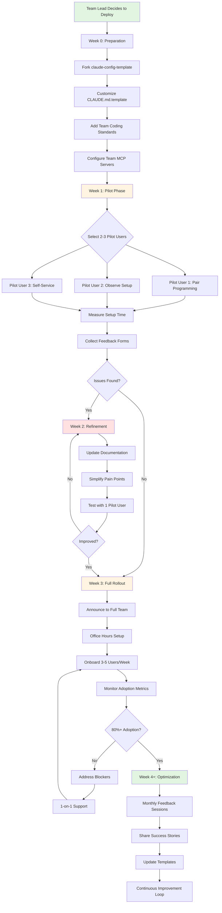
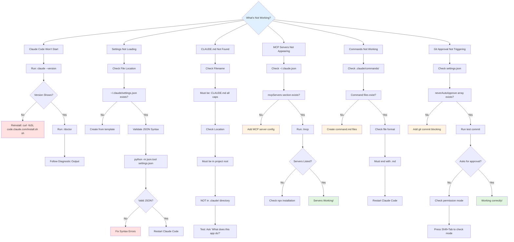

# Visual Workflows Guide

**5 Mermaid diagrams showing how Claude Code workflows actually work**

**Time to read:** 10 minutes
**Purpose:** See the complete workflows visually (complements [Workflow Integration Guide](../01-fundamentals/WORKFLOW_INTEGRATION.md))

---

## Why This Matters

**Without visual workflows:**
- Abstract concepts hard to grasp ("What's the actual sequence?")
- Miss the connections between tools
- Unclear when to use which path
- Can't see the big picture

**With visual workflows:**
- Instant understanding of complete processes
- See tool relationships clearly
- Know decision points (when to branch)
- Reference during actual work

**Time investment:** 10 minutes
**Benefit:** Clear mental model of all major workflows

---

## Workflow #1: New Project Setup

**Scenario:** Starting a fresh project with Claude Code

**Time:** 15-40 minutes per feature

---

## Workflow #2: Feature Development Loop

**Scenario:** Systematic feature implementation with quality gates

**Time:** 10-30 minutes per feature (varies by complexity)

---

## Workflow #3: Quality Gates Integration

**Scenario:** @quality-reviewer agent orchestrating parallel checks

**Time:** 15-30 seconds (parallel execution)

---

## Workflow #4: Team Onboarding

**Scenario:** Deploying Claude Code to your development team

**Time:** 4+ weeks for full team deployment

---

## Workflow #5: Troubleshooting Decision Tree

**Scenario:** Something isn't working, what do you check?

**Time:** 2-10 minutes to diagnose and fix

---

## How to Use These Diagrams

### During Planning
- **Reference Workflow #1** - Understand new project setup sequence
- **Reference Workflow #4** - Plan team rollout strategy

### During Development
- **Reference Workflow #2** - Follow TDD feature loop
- **Reference Workflow #3** - Understand quality gates

### During Troubleshooting
- **Reference Workflow #5** - Debug issues systematically

### Print and Keep Handy
Export these diagrams and keep them visible:
1. GitHub: View in README (renders Mermaid)
2. VS Code: Use Mermaid Preview extension
3. Print: Screenshot and print for desk reference

---

## Legend

**Node Colors:**
- 🟢 Green = Start/Success/Completion
- 🟡 Yellow = Agent/Tool invocation
- 🔴 Red = Error state/Parallel execution
- 🔵 Blue = Information/Check

**Node Shapes:**
- Rectangle = Action/Process
- Diamond = Decision point
- Rounded = Start/End
- Parallelogram = Input/Output

---

## Next Steps

### Understand the Flows Deeply

**Option A: Read Full Workflow Guide (15 min)**
→ [Workflow Integration Guide](../01-fundamentals/WORKFLOW_INTEGRATION.md) - Detailed explanations

**Option B: Try a Workflow (30 min)**
→ [New Project Setup](../../docs/00-start-here/personas/06_planning-new-project.md) - Follow Workflow #1

**Option C: Master Quality Gates (20 min)**
→ [Quality Workflows Guide](../00-start-here/QUALITY_WORKFLOWS.md) - Deep dive on Workflow #3

**Having trouble?** Ask Claude: "Walk me through [specific workflow from diagram]"

---

## ✅ You've Completed: Visual Workflows

**What you learned:**
- 5 complete workflows visualized (setup, development, quality, team, troubleshooting)
- Decision points (when to branch, what to check)
- Tool relationships (how agents, skills, commands connect)
- Troubleshooting paths (systematic debugging)

**Next logical step:**

**Option A: Deep Dive on One Workflow (15 min)**
→ Pick one diagram → Read corresponding detailed guide

**Option B: Practice a Workflow (30 min)**
→ Try Workflow #1 or #2 on a real project

**Option C: Master Your Weak Spot (varies)**
→ Identify which workflow confuses you → Study that one deeply

---

**Estimated next step time:** 15-30 minutes (depending on choice)
**Last Updated:** 2025-12-16
