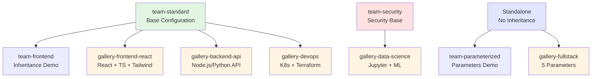

# Template Gallery Guide

**Version:** 4.3.0
**Location:** `examples/team-templates/`
**Purpose:** Curated collection of domain-specific templates demonstrating inheritance and parameterization

---

## What Is the Template Gallery?

The Template Gallery (introduced in v4.3.0) is a collection of **9 ready-to-use templates** that demonstrate real-world Claude Code configurations for different development domains. Each template showcases the power of:

- **Template Inheritance (v4.1.0):** Templates extend base configurations using the `extends` field
- **Template Parameters (v4.2.0):** Dynamic templates with customizable variables like `${company}` or `${framework}`

The gallery serves three purposes:
1. **Reference:** Learn from working examples of well-structured templates
2. **Starting point:** Copy and customize for your projects
3. **Demonstration:** See inheritance and parameterization in action

---

## Template Catalog

### Base Templates (Foundation)

| Template ID | Name | Description | Category | Recommended For |
|-------------|------|-------------|----------|-----------------|
| `team-standard` | Team Standard | Standard Claude Code configuration for teams | team | Intermediate, Advanced |
| `team-security` | Team Security | Security-focused configuration for sensitive projects | security | Intermediate, Advanced, Expert |

**Usage:** These serve as parent templates that others extend.

### Gallery Templates (v4.3.0)

| Template ID | Name | Extends | Use Case | Parameters |
|-------------|------|---------|----------|------------|
| `gallery-frontend-react` | Frontend React | team-standard | React + TypeScript + Tailwind frontend | No |
| `gallery-backend-api` | Backend API | team-standard | Node.js/Python API development | No |
| `gallery-data-science` | Data Science | team-security | Python data science with Jupyter/ML | No |
| `gallery-devops` | DevOps Infrastructure | team-standard | Kubernetes, Terraform, CI/CD | No |
| `gallery-fullstack` | Full-Stack Parameterized | (standalone) | Customizable full-stack development | **Yes** (5 params) |

### Demonstration Templates (Advanced Features)

| Template ID | Name | Feature Demonstrated | Version |
|-------------|------|---------------------|---------|
| `team-frontend` | Team Frontend | Inheritance (extends team-standard) | v4.1.0 |
| `team-parameterized` | Team Parameterized | Parameters (company, team, coverage) | v4.2.0 |

---

## Template Inheritance Hierarchy



**Legend:**
- **Green:** Base templates (foundation)
- **Red:** Security-focused base
- **Blue:** Standalone (no inheritance)
- **Yellow:** Gallery templates (ready-to-use)

---

## Template Details

### 1. gallery-frontend-react

**Use Case:** React + TypeScript + Tailwind frontend development

**Extends:** `team-standard`

**Configuration Highlights:**
- Primary languages: TypeScript, JavaScript
- Primary frameworks: React, Next.js, Tailwind, Testing Library
- Component-finder skill enabled
- Test framework: Vitest
- Recommended for: Intermediate, Advanced

**Example usage:**
```json
{
  "profile": {
    "experienceLevel": "intermediate",
    "primaryLanguages": ["typescript", "javascript"],
    "primaryFrameworks": ["react", "nextjs", "tailwind", "testing-library"]
  },
  "skillSpecificPreferences": {
    "component-finder": {
      "enabled": true,
      "searchPatterns": ["src/components/**/*.tsx", "components/**/*.tsx"]
    }
  }
}
```

---

### 2. gallery-backend-api

**Use Case:** Node.js/Python API development with testing

**Extends:** `team-standard`

**Configuration Highlights:**
- Primary languages: Node.js, Python
- Primary frameworks: Express, FastAPI, Jest, pytest
- Security scanner enabled (OWASP Top 10)
- Test generator with coverage tracking
- Recommended for: Intermediate, Advanced

**Example usage:**
```json
{
  "profile": {
    "experienceLevel": "intermediate",
    "primaryLanguages": ["javascript", "python"],
    "primaryFrameworks": ["express", "fastapi"]
  },
  "skillSpecificPreferences": {
    "security-scanner": {
      "enabled": true,
      "checkOWASP": true
    },
    "test-generator": {
      "enabled": true,
      "coverageThreshold": 80
    }
  }
}
```

---

### 3. gallery-data-science

**Use Case:** Python data science with Jupyter and ML frameworks

**Extends:** `team-security`

**Configuration Highlights:**
- Primary language: Python
- Primary frameworks: Jupyter, pandas, numpy, scikit-learn
- Extends team-security for data protection
- Security scanning enabled
- Recommended for: Intermediate, Advanced

**Example usage:**
```json
{
  "profile": {
    "experienceLevel": "intermediate",
    "primaryLanguages": ["python"],
    "primaryFrameworks": ["jupyter", "pandas", "numpy", "scikit-learn"]
  },
  "skillSpecificPreferences": {
    "security-scanner": {
      "enabled": true,
      "scanDependencies": true
    }
  }
}
```

---

### 4. gallery-devops

**Use Case:** Kubernetes, Terraform, and CI/CD workflows

**Extends:** `team-standard`

**Configuration Highlights:**
- Primary languages: YAML, HCL, Bash
- Primary frameworks: Kubernetes, Terraform, Docker, GitHub Actions
- Infrastructure-focused tooling
- Recommended for: Advanced, Expert

**Example usage:**
```json
{
  "profile": {
    "experienceLevel": "advanced",
    "primaryLanguages": ["yaml", "hcl", "bash"],
    "primaryFrameworks": ["kubernetes", "terraform", "docker"]
  }
}
```

---

### 5. gallery-fullstack (Parameterized)

**Use Case:** Customizable full-stack development with dynamic configuration

**Extends:** None (standalone, parameterized)

**Parameters:**

| Parameter | Type | Required | Default | Description |
|-----------|------|----------|---------|-------------|
| `frontendFramework` | string | Yes | - | Frontend framework: react, vue, svelte, angular |
| `backendFramework` | string | Yes | - | Backend framework: express, fastapi, django, rails |
| `database` | string | No | postgresql | Database: postgresql, mysql, mongodb, sqlite |
| `testCoverage` | number | No | 80 | Test coverage target (0-100) |
| `useTypeScript` | boolean | No | true | Use TypeScript for type safety |

**Example usage:**
```json
{
  "templateMetadata": {
    "parameters": {
      "frontendFramework": { "type": "string", "required": true },
      "backendFramework": { "type": "string", "required": true },
      "database": { "type": "string", "default": "postgresql" },
      "testCoverage": { "type": "number", "default": 80 },
      "useTypeScript": { "type": "boolean", "default": true }
    }
  },
  "contents": {
    "profile": {
      "primaryFrameworks": ["${frontendFramework}", "${backendFramework}"],
      "database": "${database}",
      "useTypeScript": "${useTypeScript}"
    },
    "skillSpecificPreferences": {
      "test-generator": {
        "coverageThreshold": "${testCoverage}"
      }
    }
  }
}
```

**Applying with parameters:**
```bash
# With v4.5.0 application script (coming soon)
./scripts/apply-template.sh gallery-fullstack \
  --param frontendFramework=react \
  --param backendFramework=fastapi \
  --param database=mongodb \
  --param testCoverage=90 \
  --param useTypeScript=true
```

---

## How to Use Templates

### Method 1: Browse and Inspect

**Step 1:** Browse the catalog
```bash
cat examples/team-templates/catalog.json | jq '.templates[] | {id, name, description}'
```

**Step 2:** Inspect a template
```bash
cat examples/team-templates/gallery-frontend-react.json | jq
```

**Step 3:** Understand inheritance
```bash
# See what gallery-frontend-react extends
jq '.templateMetadata.extends' examples/team-templates/gallery-frontend-react.json

# View the parent template
cat examples/team-templates/team-standard.json | jq
```

---

### Method 2: Copy and Customize

**Step 1:** Copy a template
```bash
cp examples/team-templates/gallery-frontend-react.json .claude/my-template.json
```

**Step 2:** Customize fields
```json
{
  "$schema": "claude-preferences-export-v1",
  "exportType": "template",
  "templateMetadata": {
    "id": "my-custom-template",
    "name": "My Custom Template",
    "extends": "team-standard",
    // Customize...
  },
  "contents": {
    // Your preferences...
  }
}
```

**Step 3:** Validate
```bash
./scripts/validate-template.sh .claude/my-template.json
```

---

### Method 3: Apply Directly (v4.5.0)

**Coming in v4.5.0:** Direct template application with inheritance resolution and parameter substitution.

```bash
# Simple template (no params)
./scripts/apply-template.sh gallery-frontend-react

# Parameterized template
./scripts/apply-template.sh gallery-fullstack \
  --param frontendFramework=react \
  --param backendFramework=express

# Interactive mode (prompts for parameters)
./scripts/apply-template.sh gallery-fullstack
```

---

## Parameter Examples

### Understanding Parameter Syntax

Templates can include placeholders that get replaced when applied:

| Syntax | Description | Example |
|--------|-------------|---------|
| `${var}` | Simple variable reference | `${company}` |
| `${var:default}` | Variable with inline default | `${database:postgresql}` |

### gallery-fullstack Parameter Breakdown

**Template definition:**
```json
{
  "templateMetadata": {
    "parameters": {
      "frontendFramework": {
        "type": "string",
        "required": true,
        "description": "Frontend framework (react, vue, svelte, angular)"
      },
      "testCoverage": {
        "type": "number",
        "default": 80,
        "description": "Test coverage target percentage (0-100)"
      }
    }
  },
  "contents": {
    "profile": {
      "primaryFrameworks": ["${frontendFramework}", "${backendFramework}"]
    },
    "skillSpecificPreferences": {
      "test-generator": {
        "coverageThreshold": "${testCoverage}"
      }
    }
  }
}
```

**After parameter substitution:**
```json
{
  "profile": {
    "primaryFrameworks": ["react", "fastapi"]
  },
  "skillSpecificPreferences": {
    "test-generator": {
      "coverageThreshold": 90
    }
  }
}
```

---

## Template Validation

Always validate templates before using:

```bash
# Validate single template
./scripts/validate-template.sh examples/team-templates/gallery-frontend-react.json

# Validate all templates
./scripts/validate-template.sh examples/team-templates/

# Validate catalog
./scripts/validate-template.sh --catalog examples/team-templates/catalog.json
```

See [Template Validator Guide](../04-ecosystem/TEMPLATE_VALIDATOR_GUIDE.md) for details.

---

## Creating Your Own Gallery Template

**Step 1:** Choose a base template to extend
```json
{
  "templateMetadata": {
    "id": "my-mobile-template",
    "name": "Mobile Development",
    "extends": "team-standard",  // Inherit from base
    "category": "mobile"
  }
}
```

**Step 2:** Add domain-specific preferences
```json
{
  "contents": {
    "profile": {
      "primaryLanguages": ["swift", "kotlin"],
      "primaryFrameworks": ["react-native", "flutter"]
    }
  }
}
```

**Step 3:** Validate and test
```bash
./scripts/validate-template.sh .claude/my-mobile-template.json
```

**Step 4:** Add to catalog (optional)
```json
{
  "templates": [
    {
      "id": "my-mobile-template",
      "name": "Mobile Development",
      "description": "React Native and Flutter mobile development",
      "category": "mobile",
      "sourceUrl": "./my-mobile-template.json"
    }
  ]
}
```

---

## Related Documentation

- **Template Validator:** Validate templates before use → [Template Validator Guide](../04-ecosystem/TEMPLATE_VALIDATOR_GUIDE.md)
- **Template Inheritance (v4.1.0):** Understanding `extends` → Search "Template Inheritance" in QUICK_REFERENCE
- **Template Parameters (v4.2.0):** Understanding parameterization → Search "Template Parameters" in QUICK_REFERENCE
- **Import/Export Preferences (v4.0.0):** Foundation of templates → Search "Import Export" in QUICK_REFERENCE

---

## Navigation

- **Previous:** [Model Selection Strategy](MODEL_SELECTION_STRATEGY.md)
- **Next:** [MCP Optimization Guide](MCP_OPTIMIZATION_GUIDE.md)
- **Up:** [Documentation Hub](../README.md)
