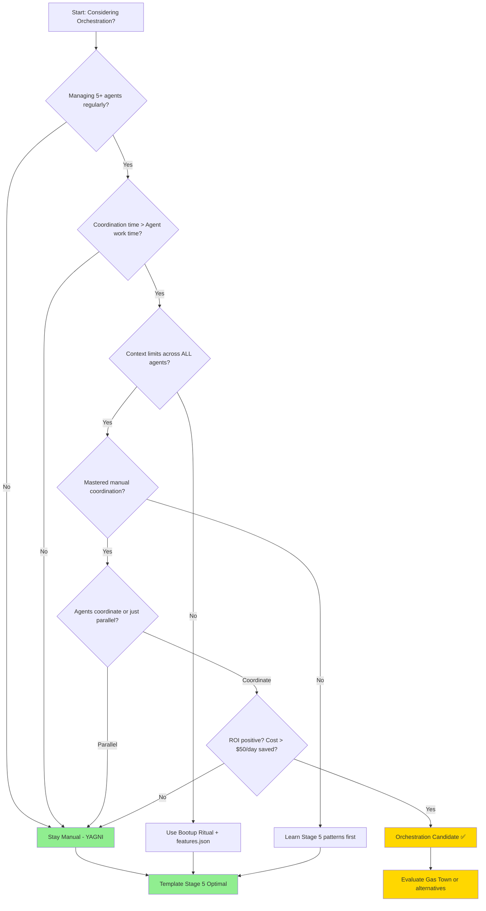

# Orchestration Decision Framework

**Do I Need Orchestration, or Is Manual Coordination Sufficient?**

## The Central Question

You're managing multiple AI coding agents. They're productive, but coordination is getting complex. A voice in your head asks: *"Should I use an orchestration tool?"*

**This guide helps you answer that question honestly.**

**Spoiler:** Most developers don't need orchestration. If you're asking the question, you probably don't need it yet. But read on—you might be the exception.

---

## TL;DR - The Four-Question Test

Answer these four questions:

1. **Am I regularly managing 5+ agents?** (No → Don't orchestrate)
2. **Is coordination time > agent work time?** (No → Don't orchestrate)
3. **Am I hitting context limits across ALL agents systematically?** (No → Don't orchestrate)
4. **Have I mastered manual coordination?** (No → Don't orchestrate)

**If you answered "No" to ANY question:** You don't need orchestration yet. YAGNI applies.

**If you answered "Yes" to ALL questions:** Read on. You might be ready.

---

## Signs You NEED Orchestration

### 1. Agent Count Threshold (5+ agents regularly)

**What it looks like:**
- You're running 5-15 agents per session
- Tracking "who's doing what" requires notes/spreadsheets
- Agent handoffs happening 15+ times per session
- You've forgotten which agent is working on which feature

**Why orchestration helps:**
- Automated agent state tracking
- Work queue management (GUPP principle)
- Visual dashboards showing agent activity
- Automatic handoff protocols

**Template alternative:**
- features.json with `workClaiming` pattern
- Manual coordination via Git branches
- Progress tracking in progress.md

**Threshold:** If you're managing 3-5 agents, manual coordination is still optimal. At 10+, orchestration ROI improves.

---

### 2. Context Window Limits (systematic, not occasional)

**What it looks like:**
- EVERY agent hitting context window limits
- Constant stop/restart cycles across all agents
- Lost work because agents "forgot" context
- Bootup rituals taking 10+ minutes per agent

**Why orchestration helps:**
- Fresh agents spun up automatically
- Context handed off to new instances
- No manual bootup ritual per agent
- Work continues seamlessly

**Template alternative:**
- Bootup ritual (manual, but explicit)
- features.json preserves state across sessions
- Prompt caching reduces context usage
- Strategic agent selection (Haiku for exploration)

**Key distinction:**
- **Occasional context limits** = Normal, bootup ritual solves it
- **Systematic context limits across ALL agents** = Orchestration candidate

---

### 3. Agent Coordination Required (not just parallel work)

**What it looks like:**
- Agents need to communicate (A's output → B's input → C's refinement)
- Work dependencies between agents are complex
- Handoffs require data transformation between agents
- You're manually translating one agent's output for another

**Why orchestration helps:**
- Pub/sub messaging between agents
- Automated data transformation pipelines
- Dependency management built-in
- Agent-to-agent communication protocols

**Template alternative:**
- Point-to-point handoffs (A → B → C explicitly)
- features.json as shared memory
- Agent log tracking (who touched what)
- Manual handoff in agent definitions

**Key distinction:**
- **Parallel work** (agents work independently) = No orchestration needed
- **Coordinated work** (agents depend on each other's output) = Orchestration helpful

---

### 4. Cost Optimization at Scale

**What it looks like:**
- Running agents costs $50-100/day
- ROI calculation shows orchestration saves money
- You have budget for orchestration tooling
- Team size justifies orchestration complexity

**Why orchestration helps:**
- Agent reuse patterns (avoid duplicate work)
- Optimal agent selection per task
- Idle agent detection and shutdown
- Cost tracking and reporting

**Template alternative:**
- Manual agent budgeting
- Model selection strategy (Haiku for cheap tasks)
- Prompt caching (85% token savings)
- Work-claiming prevents duplicate work

**ROI calculation:**
```
Manual coordination time: 2 hours/day × $100/hour = $200/day
Orchestration cost: $50/month ≈ $2/day
Orchestration setup/maintenance: 1 hour/week × $100/hour ≈ $14/day

Net ROI: $200 - $2 - $14 = $184/day saved
Annual savings: $184 × 250 working days = $46,000

ROI positive if coordination time > 30 min/day consistently
```

**Threshold:** If you're spending < 30 min/day on coordination, orchestration ROI is negative.

---

## Signs You DON'T Need Orchestration (YAGNI)

### 1. Independent Agents (parallel work)

**What it looks like:**
- Agents work on separate features simultaneously
- No inter-agent dependencies
- features.json provides all shared context needed
- Agents rarely interact

**Why orchestration is overkill:**
- No coordination problem to solve
- Parallelism already achieved
- Added complexity with no benefit
- Manual coordination is trivial

**Example:**
```
Agent 1: Building authentication feature
Agent 2: Building dashboard feature
Agent 3: Writing documentation

All independent, no handoffs needed.
```

**Verdict:** Stay manual. Orchestration adds complexity without value.

---

### 2. Under 5 Agents in Use

**What it looks like:**
- You're using 2-4 agents regularly
- Coordination is manageable
- Cognitive load is acceptable
- Learning value from manual process

**Why orchestration is premature:**
- Setup cost > benefit at this scale
- Manual coordination is still simple
- You're still learning agent patterns
- YAGNI principle applies strongly

**Cognitive load test:**
- Can you name all your agents and their current tasks from memory?
- **Yes** → Manual coordination fine
- **No** → Consider orchestration (but check if you need that many agents first)

**Verdict:** Stay at Stage 5 (template's sweet spot).

---

### 3. Template Patterns Solving Problems

**What it looks like:**
- features.json + bootup ritual working well
- Prompt caching reducing costs by 50%+
- Quality workflows catching issues early
- Context recovery taking < 5 minutes

**Why orchestration is unnecessary:**
- Current patterns solve the problems orchestration addresses
- Different approach, same result
- Educational value in manual patterns
- Transparency over automation

**Example success metrics:**
```
Context recovery: 3 minutes (bootup ritual)
Token cost: $5/day (prompt caching)
Agent coordination: 15 min/day (features.json)
Quality: 90%+ first-time-right (quality workflows)
```

**If these metrics are good, orchestration won't improve them significantly.**

**Verdict:** If it ain't broke, don't fix it.

---

### 4. Understanding Still Building

**What it looks like:**
- You're still learning Stage 4-5 patterns
- Agent coordination feels new
- You can't explain HOW bootup ritual works
- Orchestration would hide valuable learning

**Why orchestration would hurt:**
- Premature abstraction hides learning
- "Smarter over faster" principle violated
- You'll struggle to debug orchestrator without foundations
- Understanding > speed (Jake Nations Test)

**Jake Nations Test Questions:**

1. **Will orchestration make me smarter or just faster?**
   - If just faster → Don't orchestrate yet
   - If smarter (by revealing new patterns) → Maybe

2. **Will I understand what the orchestrator is doing?**
   - If no → Learn manual patterns first
   - If yes → Proceed

3. **Am I preserving complexity or creating clarity?**
   - If preserving complexity with automation → Don't orchestrate
   - If creating clarity → Proceed

**Verdict:** Master Stage 5 before graduating to Stage 6-7.

---

## Decision Tree



### How to Use This Decision Tree

1. Start at the top
2. Answer each question honestly
3. Follow the arrows
4. If you land on "Stay Manual" or "Template Stage 5 Optimal" → You don't need orchestration
5. If you land on "Orchestration Candidate" → Read the next section carefully

**Key insight:** Most paths lead to "Stay Manual." That's intentional. Orchestration is for the minority.

---

## Orchestration Tools Overview

### Gas Town (Steve Yegge)

**What it is:** Agent orchestration framework with 7 worker roles

**Key Features:**
- **GUPP Principle:** Ensure workers run available work (no idle agents)
- **Beads:** Persistent agent identities in Git (one agent = one feature over time)
- **7 Worker Roles:** Specialized agents (architect, implementer, tester, etc.)
- **Context Management:** Fresh agents spun up when old ones fill context window

**Best for:**
- Stage 6-7 developers
- 10+ agents needed regularly
- Production systems
- Teams comfortable with orchestration complexity

**Links:**
- Article: [Welcome to Gas Town](https://steve-yegge.medium.com/welcome-to-gas-town-4f25ee16dd04)
- Discussion: [Hacker News](https://news.ycombinator.com/item?id=46458936)

**Template Integration:**
- Use template's features.json schema
- Apply template's agent role patterns
- Graduate when ready (template teaches patterns, Gas Town executes them)

---

### Other Tools (Emerging Ecosystem)

**Note:** As of Jan 2026, agent orchestration is nascent. More tools will emerge.

**Hypothetical: "Kubernetes for Agents"**
- Agent lifecycle management
- Auto-scaling based on workload
- Health checks and restarts
- Resource allocation

**Custom Orchestration Layers:**
- Build your own using Gas Town patterns
- Integrate with existing CI/CD
- Company-specific workflows

**Evaluation criteria when choosing:**
1. Supports your agent count needs
2. Integrates with your stack
3. Learning curve acceptable
4. Cost justified by ROI
5. Community and support available

---

## Template's Alternative Approach

### Transparent State Over Automation

**Philosophy:** Teach patterns manually before automating them.

**Core Components:**

1. **features.json = Shared Memory**
   - Single source of truth
   - All agents read/write here
   - Visible, auditable, version-controlled
   - Work-claiming prevents conflicts

2. **Bootup Ritual = Context Recovery**
   - Explicit, teachable process
   - Read features.json → Check git status → Identify next task
   - Manual, but fast (< 5 minutes)
   - You understand WHAT you're recovering

3. **Work-Claiming = Coordination Without Orchestration**
   - Agents claim features before working
   - Other agents see "claimed" status
   - GUPP-inspired, but manual
   - Prevents duplicate work

4. **Agent Roles = Specialization**
   - initializer (planning)
   - coder (implementation)
   - quality-reviewer (validation)
   - Clear responsibilities, no automation

**What you learn:**
- How orchestration WOULD work
- Patterns worth automating
- When automation adds value
- How to debug when things go wrong

**When This Is Better:**

| Scenario | Template Better | Orchestration Better |
|----------|-----------------|----------------------|
| Educational projects | ✅ | ❌ |
| Solo developer | ✅ | ❌ |
| Small teams (< 5) | ✅ | ❌ |
| Learning agent patterns | ✅ | ❌ |
| Under 5 agents | ✅ | ❌ |
| Production systems | ❌ | ✅ |
| Large teams (10+) | ❌ | ✅ |
| 10+ agents regularly | ❌ | ✅ |
| Mature patterns, ready to automate | ❌ | ✅ |

---

### When Template Patterns Excel

**Cost Efficiency:**
- Prompt caching: 85% token reduction
- Model selection strategy: Use Haiku where possible
- Work-claiming: Prevents duplicate work (wasted tokens)
- **Result:** $5/day vs $50/day with poor orchestration

**Context Management:**
- Bootup ritual: 3-5 minute recovery
- features.json: Complete state capture
- Agent logs: Historical tracking
- **Result:** Context loss rare, recovery trivial

**Quality:**
- Quality-reviewer agent: Catches issues early
- Manual handoffs: You verify each step
- Transparent state: Audit trail visible
- **Result:** 90%+ first-time-right rate

**Learning:**
- You understand every coordination step
- Patterns explicit, not hidden
- Debugging straightforward
- **Result:** When you DO orchestrate, you'll excel

---

### When to Graduate to Orchestration

**Graduation criteria (ALL must be true):**

1. ✅ You've mastered Stage 5 patterns
   - Can explain bootup ritual from memory
   - Understand work-claiming purpose
   - Know when to use each agent

2. ✅ Manual coordination genuinely limits you
   - Spending 2+ hours/day on coordination
   - 10+ agents needed regularly
   - Context window systematically hitting limits

3. ✅ ROI clearly positive
   - Cost savings > orchestration expense
   - Time savings > learning investment
   - Complexity budget allows increase

4. ✅ Production requirements demand it
   - Team size requires automation
   - Reliability > transparency
   - Agent patterns proven and repeatable

**If ANY criterion is false:** Stay at Stage 5 (template).

**If ALL criteria are true:** Graduate to Stage 6-7 (Gas Town, etc.).

**Graduation gift from template:**
- features.json schema (orchestrators can adopt)
- Agent role patterns (proven specialization)
- Quality workflows (integrate with orchestration)
- Understanding of WHAT to automate and WHY

---

## Common Mistakes

### Mistake 1: Premature Orchestration

**What it looks like:**
- "I'm at Stage 4 but Gas Town sounds cool"
- Setting up orchestration with 2-3 agents
- Future-proofing for needs you don't have

**Why it hurts:**
- Complexity cost > benefit
- Learning opportunity lost
- Debugging becomes harder
- YAGNI principle violated

**Solution:**
- Master Stage 4-5 first
- Prove you need 5+ agents before orchestrating 5+ agents
- Let pain drive adoption, not hype

---

### Mistake 2: Over-Engineering Coordination

**What it looks like:**
- Building custom orchestration for 3 agents
- Complex message queues for simple handoffs
- Microservices architecture for agent coordination

**Why it hurts:**
- Features.json solves this simply
- Over-engineering = premature abstraction
- Maintenance burden increases
- Violates KISS principle

**Solution:**
- Start with features.json + work-claiming
- Upgrade to orchestration only when simple patterns break
- "Simple over easy" (Jake Nations Test)

---

### Mistake 3: Wrong Problem Diagnosis

**What it looks like:**
- "My agents are slow, I need orchestration"
- "Quality is poor, orchestration will fix it"
- "I'm confused, maybe orchestration helps"

**Why it hurts:**
- Orchestration solves COORDINATION, not these problems
- Slow agents → model selection or prompting issue
- Poor quality → quality-reviewer agent needed
- Confusion → learning issue, not tooling issue

**Correct diagnosis:**
| Symptom | Actual Problem | Solution |
|---------|----------------|----------|
| Slow agents | Wrong model choice | Use Haiku for exploration |
| Poor quality | No quality checks | Add quality-reviewer agent |
| High cost | No prompt caching | Enable caching, use Haiku |
| Context loss | No bootup ritual | Implement features.json + bootup |
| Confusion | Learning curve | Read ANTI_PATTERNS, fundamentals |
| **Coordination overhead** | **Too many agents** | **Orchestration (maybe)** |

**Solution:** Diagnose correctly before prescribing orchestration.

---

### Mistake 4: Skipping the Learning

**What it looks like:**
- Jumping from Stage 3 (YOLO mode) to Stage 7 (orchestration)
- Using orchestration without understanding manual patterns
- "It's automated, I don't need to understand it"

**Why it hurts:**
- Can't debug when orchestration fails
- Don't understand WHAT is being automated
- Missing foundational patterns
- Jake Nations Test failure ("faster not smarter")

**Solution:**
- Stage progression: 3 → 4 → 5 → (evaluate) → 6 or 7
- Master manual coordination before automating it
- Understand the WHY before the HOW
- "Smarter over faster" always

---

## Integration Guide: Template + Gas Town

**Scenario:** You've decided you need orchestration. How do you integrate?

### Phase 1: Preparation (While Still on Template)

**Week 1-2: Standardize Patterns**
1. Ensure features.json schema is consistent
2. Document your agent roles clearly
3. Audit work-claiming patterns
4. Review bootup rituals for all agents

**Goal:** Clean, documented patterns that orchestration can adopt

---

### Phase 2: Parallel Running (Hybrid Mode)

**Week 3-4: Run Both Systems**
1. Keep template's features.json as source of truth
2. Start Gas Town with 2-3 agents
3. Manual coordination for core work
4. Orchestration for experimental tasks

**Goal:** Learn Gas Town without risking production work

---

### Phase 3: Migration (Gradual Handoff)

**Week 5-8: Shift Coordination to Orchestrator**
1. Move agent-by-agent to Gas Town
2. Keep features.json, integrate with Gas Town
3. Deprecate manual bootup rituals
4. Monitor for regressions

**Goal:** Smooth transition, no lost work

---

### Phase 4: Optimization (Post-Migration)

**Week 9-12: Tune Orchestration**
1. Adjust Gas Town worker roles
2. Optimize GUPP patterns
3. Integrate template's quality workflows
4. Measure ROI vs manual baseline

**Goal:** Orchestration performing better than manual

---

### Success Metrics

**Compare before/after:**

| Metric | Template (Before) | Gas Town (After) | Target |
|--------|-------------------|------------------|--------|
| Coordination time | 30 min/day | 5 min/day | 80% reduction |
| Context recovery | 5 min | Automated | < 1 min |
| Agent utilization | 60% | 85% | 25% improvement |
| Cost | $10/day | $15/day | Net positive ROI |
| Quality | 90% | 90%+ | Maintain or improve |

**If metrics don't improve:** Investigate. Orchestration might not be the right fit yet.

---

## Real-World Case Studies

### Case Study 1: Solo Developer (Stayed at Stage 5)

**Profile:**
- Solo developer, 3 side projects
- Using initializer + coder + quality-reviewer (3 agents)
- features.json working well

**Decision:** Evaluated orchestration, decided to stay manual
**Reason:** 3 agents manageable, high learning value, ROI negative
**Outcome:** 2 years later, still at Stage 5, happy with decision

**Lesson:** Not everyone needs to progress. Stage 5 is valid long-term.

---

### Case Study 2: Small Team (Graduated to Stage 7)

**Profile:**
- 5-person startup, production system
- Started at Stage 5 (template)
- Grew to need 12 agents regularly

**Decision:** Migrated to Gas Town after 6 months at Stage 5
**Reason:** Coordination overhead 3 hours/day, ROI clearly positive
**Outcome:** Coordination time dropped to 20 min/day, quality maintained

**Lesson:** Template taught patterns, Gas Town scaled them. Right progression.

---

### Case Study 3: Enterprise Team (Should Have Stayed at Stage 5)

**Profile:**
- 20-person team, complex enterprise app
- Jumped from Stage 3 to custom orchestration
- Skipped Stage 4-5 learning

**Decision:** Built custom orchestrator without understanding manual patterns
**Reason:** Shiny object syndrome, "future-proofing"
**Outcome:** 6 months debugging orchestrator, quality dropped, reverted to Stage 4

**Lesson:** Skipping stages is expensive. Learn before you automate.

---

## Your Decision Framework Checklist

Use this checklist to make your orchestration decision:

### Prerequisites (Must Have ALL)

- [ ] I'm managing 5+ agents regularly
- [ ] I understand bootup rituals and can explain them
- [ ] I've mastered features.json work-claiming
- [ ] I can name my agent roles and their purposes
- [ ] I've been at Stage 5 for 2+ months (not days)

### Pain Points (Must Have 3+)

- [ ] Coordination time > 1 hour/day
- [ ] Context window limits across ALL agents systematically
- [ ] Lost work due to poor coordination
- [ ] Team members confused about agent state
- [ ] Agent idle time > 20% (poor utilization)
- [ ] Manual handoffs failing regularly
- [ ] Quality regressions from coordination errors

### ROI (Must Have Positive ROI)

- [ ] Coordination cost (time × hourly rate) > $100/day
- [ ] Orchestration would save > 50% coordination time
- [ ] Budget exists for orchestration tooling/learning
- [ ] ROI payback period < 3 months

### Readiness (Must Have ALL)

- [ ] I've read Gas Town article and understand it
- [ ] I can explain GUPP principle in my own words
- [ ] I know what Beads are and why they matter
- [ ] I've budgeted 2-4 hours for orchestration setup
- [ ] I've budgeted 1 hour/week for orchestration maintenance

### Final Decision

**Prerequisites met?** (5/5) ✅
**Pain points?** (3+/7) ✅
**Positive ROI?** (3/3) ✅
**Readiness?** (5/5) ✅

→ **Orchestration is appropriate. Proceed to integration guide.**

**ANY section incomplete?**
→ **Stay at Stage 5. Revisit in 2-3 months.**

---

## TL;DR Summary

**You DON'T need orchestration if:**
- Managing < 5 agents
- Coordination time < 30 min/day
- Template patterns solving your problems
- Still learning Stage 4-5 patterns
- ROI unclear or negative

**You DO need orchestration if:**
- Managing 10+ agents regularly
- Coordination time > 2 hours/day
- Context limits systematic across all agents
- Mastered manual patterns and ready to automate
- Clear positive ROI

**Most developers:** Stay at Stage 5 (template's sweet spot)
**Minority who need scale:** Graduate to Stage 6-7 (Gas Town, etc.)
**Everyone:** Learn manual patterns before automating them

---

## Next Steps

**Decided NOT to orchestrate?**
→ Optimize Stage 5: [Quality Workflows Guide](03_quality-workflows-guide.md)
→ Reduce costs: [Token Optimization](../02-optimization/)
→ Improve quality: [Coding Principles Handbook](../01-fundamentals/06_coding-principles-handbook.md)

**Decided TO orchestrate?**
→ Read Gas Town: [Welcome to Gas Town](https://steve-yegge.medium.com/welcome-to-gas-town-4f25ee16dd04)
→ Review integration: See "Integration Guide" section above
→ Compare approaches: [External Perspectives Pattern 10](.claude/skills/external-perspectives/SKILL.md)

**Still unsure?**
→ Run the checklist above
→ Wait 2 months at Stage 5
→ Re-evaluate with more data

---

## Sources & Further Reading

**Primary Sources:**
- [Welcome to Gas Town](https://steve-yegge.medium.com/welcome-to-gas-town-4f25ee16dd04) - Steve Yegge, Jan 2026
- [Hacker News Discussion](https://news.ycombinator.com/item?id=46458936)
- [The Infinite Software Crisis](https://www.youtube.com/watch?v=eIoohUmYpGI) - Jake Nations (Netflix)

**Related Template Docs:**
- [Agent Evolution Stages](07_agent-evolution-stages.md)
- [External Perspectives - Pattern 10 (Gas Town)](.claude/skills/external-perspectives/SKILL.md)
- [Quality Workflows Guide](03_quality-workflows-guide.md)

**Decision Frameworks:**
- YAGNI Principle ("You Aren't Gonna Need It")
- Jake Nations Test (Smarter over faster)
- ROI Calculation (Cost vs benefit)

---

## Navigation

← Previous: [Agent Evolution Stages](07_agent-evolution-stages.md)
→ Next: [Advanced MCP Workflows](04_advanced-mcp-workflows.md)
↑ Up: [Advanced Topics](README.md)
