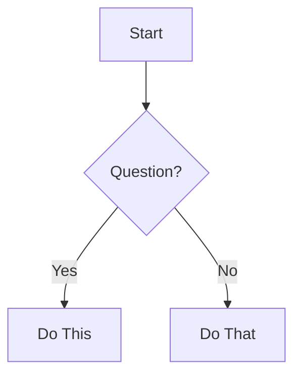

# Mermaid Diagram Setup Guide

**Problem:** Diagrams don't render in your local markdown editor
**Solution:** Upgrade to Mermaid 10.x+ or use ASCII alternatives
**Time to fix:** 2-5 minutes

---

## Why Diagrams May Not Render

This template uses **Mermaid 10.x+** features for modern, feature-rich diagrams:
- `flowchart` syntax (vs older `graph`)
- `sankey-beta` diagrams for data flow visualization
- Advanced formatting (emojis, special characters, multiple line breaks)

**Your editor's Mermaid version:**
- **GitHub:** ✅ 10.x+ (renders automatically)
- **VS Code (default):** ❌ 8.x-9.x (outdated)
- **VS Code (updated):** ✅ 10.x+ (after extension install)

---

## Solution 1: Upgrade VS Code Extension (Recommended)

### Step 1: Install Mermaid Extension

**Option A: Via VS Code Marketplace**
1. Open VS Code
2. Click Extensions icon (Cmd+Shift+X / Ctrl+Shift+X)
3. Search: "Markdown Preview Mermaid Support"
4. Click "Install" on the extension by Matt Bierner
5. Reload VS Code

**Option B: Via Command Line**
```bash
code --install-extension bierner.markdown-mermaid
```

**Extension Link:**
https://marketplace.visualstudio.com/items?itemName=bierner.markdown-mermaid

### Step 2: Verify Installation

1. Open any markdown file with Mermaid diagrams:
   - `docs/00-start-here/06_visual-guides.md`
   - `docs/00-start-here/08_visual-workflows.md`
   - `docs/00-start-here/07_visual-quickstart.md`

2. Open Markdown Preview (Cmd+Shift+V / Ctrl+Shift+V)

3. **Success:** Diagrams render with colors and proper formatting
   **Failure:** See Troubleshooting section below

---

## Solution 2: View on GitHub

**Easiest option:** View documentation directly on GitHub where diagrams render automatically.

**Quick links:**
- [Visual Learning Guides](https://github.com/your-repo/claude-config-template/blob/main/docs/00-start-here/06_visual-guides.md)
- [Visual Workflows](https://github.com/your-repo/claude-config-template/blob/main/docs/00-start-here/08_visual-workflows.md)
- [Visual Quickstart](https://github.com/your-repo/claude-config-template/blob/main/docs/00-start-here/07_visual-quickstart.md)

**Pros:**
- ✅ No setup required
- ✅ Always up-to-date rendering
- ✅ Works from any device

**Cons:**
- ❌ Requires internet connection
- ❌ Can't preview local changes before committing

---

## Solution 3: Use mermaid.live

**Interactive editor** for testing and viewing Mermaid diagrams.

### Steps:
1. Go to https://mermaid.live
2. Copy diagram code from documentation file
3. Paste into left panel
4. View rendered diagram on right panel

**Use cases:**
- Quick preview without installing extensions
- Testing diagram modifications
- Exporting diagrams as PNG/SVG

**Pros:**
- ✅ No installation needed
- ✅ Latest Mermaid features
- ✅ Export options (PNG, SVG, markdown)

**Cons:**
- ❌ Manual copy-paste required
- ❌ Not integrated with VS Code

---

## Solution 4: Use ASCII Alternatives

**Every diagram** in this template has an ASCII art alternative for universal compatibility.

### Where to find ASCII versions:

**In `docs/00-start-here/06_visual-guides.md`:**
- Configuration Hierarchy (line ~240)
- Model Selection (line ~270)
- Setup Progress (line ~290)

**In `docs/00-start-here/08_visual-workflows.md`:**
- ASCII alternatives provided for complex workflows where applicable

### Example:

**Mermaid version** (requires Mermaid 10.x+):


**ASCII version** (works everywhere):
```
┌─────────┐
│  START  │
└────┬────┘
     │
 ┌───▼──────┐
 │ Question?│
 └───┬──────┘
  ┌──┴──┐
 YES   NO
  │     │
┌─▼──┐ ┌▼───┐
│Do  │ │Do  │
│This│ │That│
└────┘ └────┘
```

---

## Troubleshooting

### Issue 1: Extension installed but diagrams still don't render

**Symptoms:**
- Extension shows as installed
- Preview still shows raw Mermaid code
- No error messages

**Solutions:**
1. **Reload VS Code window:**
   - Cmd+Shift+P / Ctrl+Shift+P
   - Type: "Reload Window"
   - Hit Enter

2. **Check Markdown Preview:**
   - Use built-in preview: Cmd+Shift+V / Ctrl+Shift+V
   - Don't use third-party markdown extensions that might override

3. **Verify extension is enabled:**
   - Go to Extensions panel
   - Search for installed "Markdown Preview Mermaid Support"
   - Ensure not disabled

4. **Update VS Code:**
   - Help → Check for Updates
   - Restart VS Code after update

### Issue 2: Diagrams render but look broken

**Symptoms:**
- Diagrams show but text overlaps
- Missing colors or styling
- Layout is distorted

**Cause:** Extension uses older Mermaid version (9.x instead of 10.x)

**Solutions:**
1. **Update extension:**
   - Extensions panel → Click gear icon on "Markdown Preview Mermaid Support"
   - Select "Check for Updates"

2. **Check extension version:**
   - Should be v1.17.0+ for Mermaid 10.x support
   - If older, update to latest version

3. **Fallback:**
   - Use ASCII alternatives provided in documentation
   - Or view on GitHub where rendering is guaranteed

### Issue 3: Specific diagrams fail (sankey, flowchart)

**Symptoms:**
- Some diagrams work, others don't
- Specifically: Token Cost Waterfall, Model Selection Flowchart

**Cause:** These use Mermaid 10.x exclusive features:
- `sankey-beta` (experimental diagram type)
- `flowchart` keyword (newer syntax)

**Solutions:**
1. **Ensure Mermaid 10.x+:**
   - Check extension changelog
   - Update to latest version

2. **Use ASCII alternatives:**
   - Every advanced diagram has ASCII fallback
   - Look for "ASCII Alternative" sections in documentation

3. **View on GitHub:**
   - GitHub uses Mermaid 10.x+
   - Guaranteed to render all diagram types

### Issue 4: Emojis or special characters render incorrectly

**Symptoms:**
- Emoji show as boxes or question marks
- Math symbols (≥, <) don't display
- Arrows or special characters corrupted

**Cause:** Font or encoding issues in your editor

**Solutions:**
1. **Use a modern font:**
   - VS Code Settings → Font Family
   - Try: "Fira Code", "JetBrains Mono", or "SF Mono"

2. **Check file encoding:**
   - Bottom-right of VS Code window
   - Should show "UTF-8"
   - If not, click and select "Reopen with Encoding" → UTF-8

3. **Install emoji font:**
   - macOS: Built-in emoji support
   - Windows: Install "Segoe UI Emoji" font
   - Linux: Install "Noto Color Emoji" package

---

## Editor-Specific Guides

### For Obsidian Users

**Good news:** Obsidian has built-in Mermaid support (10.x+ as of v1.3.0)

**If diagrams don't render:**
1. Update Obsidian to latest version
2. Settings → Editor → Enable "Live Preview"
3. View mode should show rendered diagrams

### For Typora Users

Typora includes Mermaid but may use older version.

**Steps:**
1. Preferences → Markdown → Mermaid Diagrams
2. Enable "Mermaid"
3. Check version in About dialog
4. Update Typora if < v1.5 (includes Mermaid 10.x)

### For GitHub Desktop Users

GitHub Desktop markdown preview uses older Mermaid version.

**Solution:** View on GitHub.com instead (click "View on GitHub" button)

---

## What Mermaid Features We Use

### Standard Features (Mermaid 8.x+)
✅ Works in most editors
- `graph TD/LR/TB` diagrams
- Basic flowcharts
- Gantt charts
- Simple node styling

### Modern Features (Mermaid 10.x+)
⚠️ Requires extension update
- `flowchart` keyword (vs `graph`)
- `sankey-beta` diagrams
- Multiple `<br/>` in labels
- Emoji in nodes
- Complex special characters (≥, <, ~)

---

## Quick Decision Matrix

**Choose your solution based on your needs:**

| Your Situation | Recommended Solution | Time |
|----------------|---------------------|------|
| Using VS Code regularly | Install Mermaid extension | 2 min |
| Just need quick reference | View on GitHub | 0 min |
| Testing diagram changes | Use mermaid.live | 1 min |
| No internet / prefer text | Use ASCII alternatives | 0 min |
| Other editor (Obsidian/Typora) | Update editor to latest version | 5 min |

---

## Still Having Issues?

### Check System Requirements

**VS Code:**
- Version: 1.60.0+ (older versions may not support extension)
- Update: Code → Check for Updates

**Internet connection:**
- Some extensions need to download Mermaid renderer on first use
- Temporary internet access required for initial setup

### Report a Bug

If diagrams still don't render after following this guide:

1. Check your setup:
   - VS Code version: Help → About
   - Extension version: Extensions → Markdown Preview Mermaid Support → Details
   - Mermaid version: Check extension changelog

2. Open an issue:
   - Repository: https://github.com/your-repo/claude-config-template/issues
   - Include: VS Code version, extension version, which diagram fails
   - Screenshot of error (if any)

---

## Success Checklist

After following this guide, you should have:

- [ ] Extension installed (if using VS Code)
- [ ] Markdown preview shows rendered diagrams (not code blocks)
- [ ] All diagram types render correctly:
  - [ ] Configuration Hierarchy
  - [ ] Model Selection Flowchart
  - [ ] Token Cost Waterfall (sankey)
  - [ ] Workflow diagrams
  - [ ] Decision trees
- [ ] Emojis and special characters display correctly
- [ ] ASCII alternatives identified as fallback option

---

## Resources

**Official Mermaid Documentation:**
- https://mermaid.js.org/intro/

**VS Code Extension:**
- https://marketplace.visualstudio.com/items?itemName=bierner.markdown-mermaid

**Mermaid Live Editor:**
- https://mermaid.live

**This Template's Diagram Files:**
- [Visual Learning Guides](../00-start-here/06_visual-guides.md)
- [Visual Workflows](../00-start-here/08_visual-workflows.md)
- [Visual Quickstart](../00-start-here/07_visual-quickstart.md)

---

**Last Updated:** 2025-12-17
**Mermaid Version Required:** 10.x+
**VS Code Extension:** Markdown Preview Mermaid Support v1.17.0+
