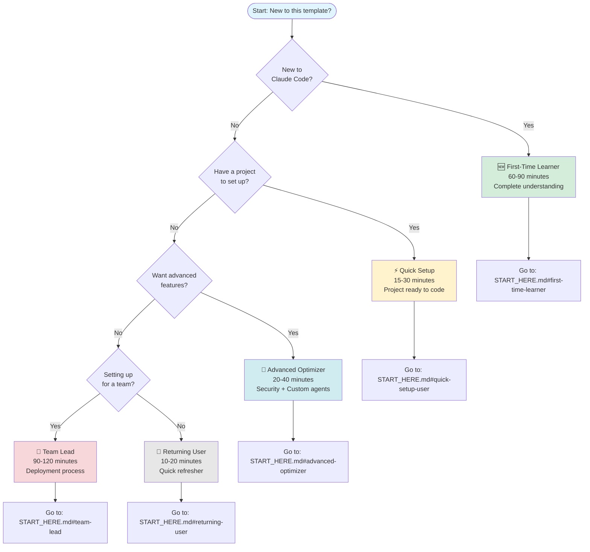

# Visual Quickstart - Choose Your Path

**Find your path in 60 seconds** using this visual decision tree.

Not sure where to start? Answer a few quick questions and we'll point you to the right setup path.

---

## 🗺️ Interactive Decision Flowchart



---

## 📋 ASCII Alternative (For Terminal/Text Mode)

```
┌─────────────────────────────────────────┐
│  START: New to this template?           │
└─────────────────┬───────────────────────┘
                  │
        ┌─────────┴─────────┐
        │  New to Claude    │
        │  Code?            │
        └─────────┬─────────┘
         ┌────────┴────────┐
         │                 │
        YES               NO
         │                 │
    ┌────▼────┐      ┌────▼────────┐
    │ 🆕 FIRST │      │ Have project│
    │  TIME   │      │  to set up? │
    │         │      └────┬────────┘
    │ 60-90min│      ┌────┴────┐
    └─────────┘      │         │
                    YES       NO
                     │         │
               ┌─────▼──┐  ┌──▼────────┐
               │ ⚡QUICK│  │ Want adv. │
               │  SETUP │  │ features? │
               │ 15-30  │  └──┬────────┘
               │  min   │  ┌──┴────┐
               └────────┘  │       │
                          YES     NO
                           │       │
                     ┌─────▼─┐ ┌──▼──────┐
                     │🚀 ADV │ │Setting  │
                     │ 20-40 │ │up team? │
                     │  min  │ └──┬──────┘
                     └───────┘ ┌──┴────┐
                               │       │
                              YES     NO
                               │       │
                          ┌────▼──┐┌──▼──────┐
                          │👥TEAM ││🔄RETURN │
                          │90-120 ││10-20min │
                          │  min  │└─────────┘
                          └───────┘
```

---

## 🎯 Quick Profile Selector

Still not sure? Use this quick selector:

### ❓ Question 1: Experience with Claude Code

- **"I've never used Claude Code before"** → [First-Time Learner](#first-time-learner)
- **"I've used Claude Code, just need project setup"** → [Quick Setup](#quick-setup)
- **"I'm experienced, want advanced features"** → [Advanced Optimizer](#advanced-optimizer)

### ❓ Question 2: Your Situation

- **"Just me, solo developer"** → [Quick Setup](#quick-setup) or [First-Time Learner](#first-time-learner)
- **"Setting up for my whole team"** → [Team Lead](#team-lead)
- **"Used this before, need refresher"** → [Returning User](#returning-user)

### ❓ Question 3: Time Available Right Now

- **"5 minutes"** → [5-Minute Win](5_MINUTE_SUCCESS.md)
- **"15-30 minutes"** → [Quick Setup](#quick-setup)
- **"1-2 hours"** → [First-Time Learner](#first-time-learner)
- **"2+ hours"** → [Team Lead](#team-lead)

---

## 📚 Persona Details

### 🆕 First-Time Learner

**You are:**
- New to Claude Code
- Want to learn it properly from scratch
- Have time to invest in understanding

**Time commitment:** 60-90 minutes

**What you'll get:**
- Complete understanding of Claude Code concepts
- Working setup for your first project
- Knowledge of cost-saving strategies
- Confidence to use Claude Code independently

**Your path:**
1. Install Claude Code globally
2. Learn core concepts (CLAUDE.md, model switching, permission modes)
3. Understand token optimization (save 50-95%!)
4. Set up your first project with validation

**Start here:** [First-Time Learner Guide](../START_HERE.md#first-time-learner)

**Alternative:** [Run the wizard](../START_HERE.md) → Select "First-Time Learner"

---

### ⚡ Quick Setup

**You are:**
- Already familiar with Claude Code
- Just need to configure this project quickly
- Know the concepts, want the fastest setup

**Time commitment:** 15-30 minutes

**What you'll get:**
- Fully configured project ready to code
- CLAUDE.md template customized for your project
- Claude Code settings optimized
- Immediate productivity boost

**Your path:**
1. Copy `.claude/` folder to your project
2. Copy and customize CLAUDE.md template
3. Document your project's business purpose
4. Test with Claude Code

**Start here:** [Quick Setup Guide](../START_HERE.md#quick-setup-user)

**Alternative:** [Run the wizard](../START_HERE.md) → Select "Quick Setup"

**Even faster?** Try the [5-Minute Win](5_MINUTE_SUCCESS.md) first!

---

### 🚀 Advanced Optimizer

**You are:**
- Experienced with Claude Code
- Want production-grade advanced features
- Interested in security, custom agents, integrations

**Time commitment:** 20-40 minutes

**What you'll get:**
- Security hooks (prompt injection detection)
- Custom agents for specialized workflows
- MCP server integrations (database, GitHub, etc.)
- Advanced optimization techniques

**Your path:**
1. Install security hooks and validation
2. Create custom agents for your workflow
3. Configure MCP servers (Context7, GitHub, Memory)
4. Test advanced features

**Start here:** [Advanced Optimizer Guide](../START_HERE.md#advanced-optimizer)

**Alternative:** [Run the wizard](../START_HERE.md) → Select "Advanced Optimizer"

---

### 👥 Team Lead

**You are:**
- Deploying Claude Code to your entire team
- Need a repeatable, documented process
- Want consistent standards across the team

**Time commitment:** 90-120 minutes (one-time investment)

**What you'll get:**
- Team rollout strategy (pilot → full deployment)
- Shared template repository
- Team-specific coding standards
- Onboarding documentation for new team members
- Pilot deployment validation

**Your path:**
1. Plan rollout strategy
2. Create shared template fork
3. Document team-specific standards
4. Onboard 2-3 pilot users
5. Gather feedback and refine
6. Roll out to full team

**Start here:** [Team Lead Guide](../START_HERE.md#team-lead)

**Alternative:** [Run the wizard](../START_HERE.md) → Select "Team Lead"

---

### 🔄 Returning User

**You are:**
- Used Claude Code before but it's been a while
- Need a quick refresher on commands and workflow
- Want to check what's new in this version

**Time commitment:** 10-20 minutes

**What you'll get:**
- Quick refresher on essential commands
- Model switching strategy recap
- What's new in v2.5.0
- Quick reference card for daily use

**Your path:**
1. Review essential commands
2. Refresh model switching pattern (Sonnet→Haiku)
3. Check new features (Checkpointing, Background tasks, etc.)
4. Get quick reference card

**Start here:** [Returning User Guide](../START_HERE.md#returning-user)

**Alternative:** [Quick Reference](../QUICK_REFERENCE.md) *(coming soon)*

---

## ⚡ Super Quick Decision Matrix

|  | New to Claude Code? | Have Project? | Want Advanced Features? | For Team? | Your Path |
|---|---|---|---|---|---|
| **1** | ✅ Yes | - | - | ❌ No | **🆕 First-Time** (60-90 min) |
| **2** | ❌ No | ✅ Yes | ❌ No | ❌ No | **⚡ Quick Setup** (15-30 min) |
| **3** | ❌ No | ❌ No or Done | ✅ Yes | ❌ No | **🚀 Advanced** (20-40 min) |
| **4** | - | - | - | ✅ Yes | **👥 Team Lead** (90-120 min) |
| **5** | ❌ No | ❌ No | ❌ No | ❌ No | **🔄 Returning** (10-20 min) |

---

## 🎮 Try It: 30-Second Quiz

Answer YES or NO to find your perfect path:

1. **Have you used Claude Code before?**
   - NO → Go to question 2
   - YES → Go to question 3

2. **Do you have 60+ minutes to learn?**
   - YES → **[First-Time Learner](../START_HERE.md#first-time-learner)**
   - NO → Try **[5-Minute Win](5_MINUTE_SUCCESS.md)** first, then decide

3. **Are you setting up for a team?**
   - YES → **[Team Lead](../START_HERE.md#team-lead)**
   - NO → Go to question 4

4. **Do you want advanced features (security, custom agents)?**
   - YES → **[Advanced Optimizer](../START_HERE.md#advanced-optimizer)**
   - NO → **[Quick Setup](../START_HERE.md#quick-setup-user)** or **[Returning User](../START_HERE.md#returning-user)**

---

## 🚀 Not Sure? Start Here

**Recommended for everyone:**

### Option 1: The 5-Minute Win (Recommended!)
Get one quick success first, then decide your path.

**→ [5-Minute Success Guide](5_MINUTE_SUCCESS.md)**

**Why this is great:**
- Instant confidence boost
- See the value in 5 minutes
- Helps you decide which full path to take
- Risk-free way to explore

---

### Option 2: Use the Interactive Wizard
Let the wizard guide you through the decision.

```bash
cd ~/claude-config-template
./scripts/claude-wizard.sh
```

The wizard will:
- Ask about your experience
- Recommend the best path
- Guide you through setup
- Validate each step

---

### Option 3: Browse First
Explore what this template offers before committing.

**Check out:**
- [README](../README.md) - Full overview
- [Visual Guides](../VISUAL_GUIDES.md) - Concept diagrams
- [Feature List](../README.md#feature-index) - What's included

---

## 📊 Path Comparison

| Path | Time | Difficulty | Outcome | Best For |
|------|------|------------|---------|----------|
| **5-Min Win** | 5 min | Easy | Demo value | Everyone (try first!) |
| **First-Time** | 60-90 min | Beginner | Full understanding | Newcomers |
| **Quick Setup** | 15-30 min | Easy | Working project | Experienced users |
| **Advanced** | 20-40 min | Intermediate | Production features | Power users |
| **Team Lead** | 90-120 min | Intermediate | Team deployment | Leaders/Managers |
| **Returning** | 10-20 min | Easy | Quick refresh | Previous users |

---

## 💡 Pro Tips

**Tip 1: Start with the 5-Minute Win**
Even if you're experienced, the 5-minute guide gives you instant validation and demonstrates the core value proposition.

**Tip 2: Paths Are Not Exclusive**
You can do Quick Setup today and come back for Advanced features later. Or start with First-Time Learner and skip to Advanced when comfortable.

**Tip 3: Use the Wizard for Validation**
The wizard includes knowledge checks and validation at each step - helpful even if you're using the manual guides.

**Tip 4: Bookmark This Page**
This visual guide helps you orient quickly. Bookmark it for future reference.

---

## ❓ Still Stuck?

### Common Scenarios:

**"I want to try it but don't have much time"**
→ [5-Minute Win](5_MINUTE_SUCCESS.md) - See the value immediately

**"I'm experienced but new to this template"**
→ [Quick Setup](../START_HERE.md#quick-setup-user) - Fastest path to productivity

**"I want to understand everything"**
→ [First-Time Learner](../START_HERE.md#first-time-learner) - Comprehensive learning path

**"I need to convince my team first"**
→ [5-Minute Win](5_MINUTE_SUCCESS.md) + [Success Stories](SUCCESS_STORIES.md) *(coming soon)*

**"Just give me the commands!"**
→ [Quick Reference](../QUICK_REFERENCE.md) or [README Quick Start](../README.md#quick-start-by-persona)

---

## 🏁 Ready to Begin?

**Choose your adventure:**

- **🏃 I'm ready now** → Pick a path above and click the link
- **🎓 Let the wizard guide me** → Run `./scripts/claude-wizard.sh`
- **⚡ Quick win first** → [5-Minute Success](5_MINUTE_SUCCESS.md)
- **📖 Learn more first** → [Back to README](../README.md)

---

## Navigation

**🏠 [Back to README](../README.md)** | **🗺️ [Detailed Paths](../START_HERE.md)** | **⚡ [5-Minute Win](5_MINUTE_SUCCESS.md)**

---

*Part of the [Claude Code Configuration Template](https://github.com/your-repo) - v2.5.0*
